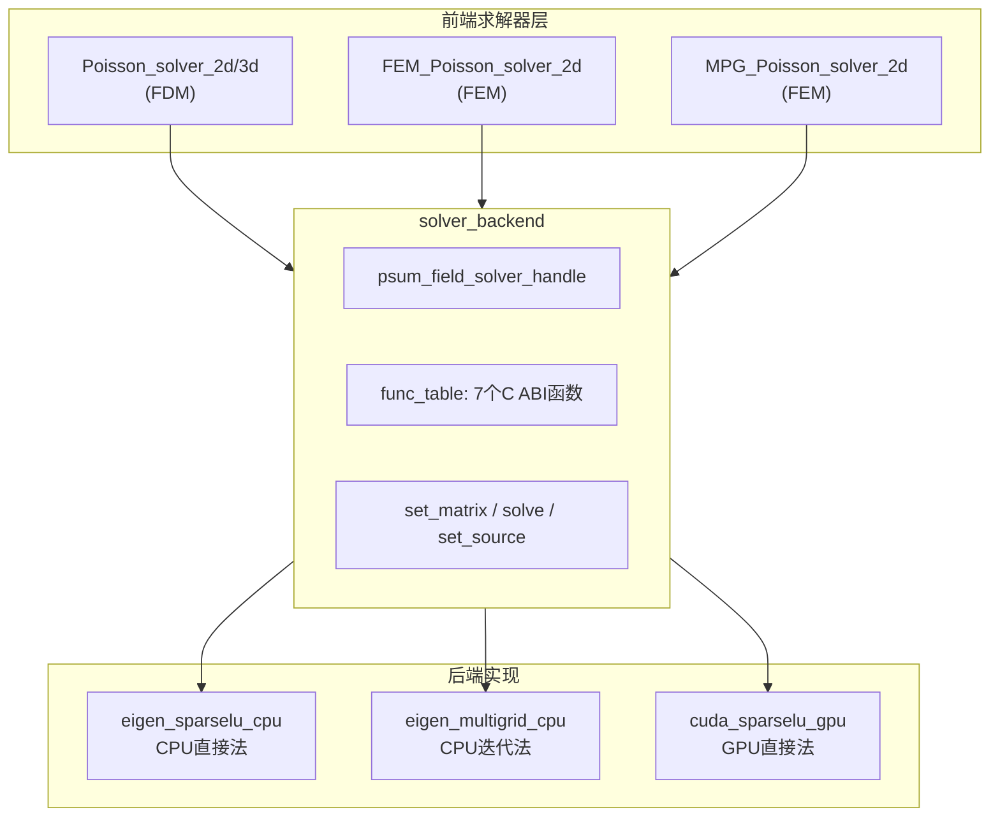
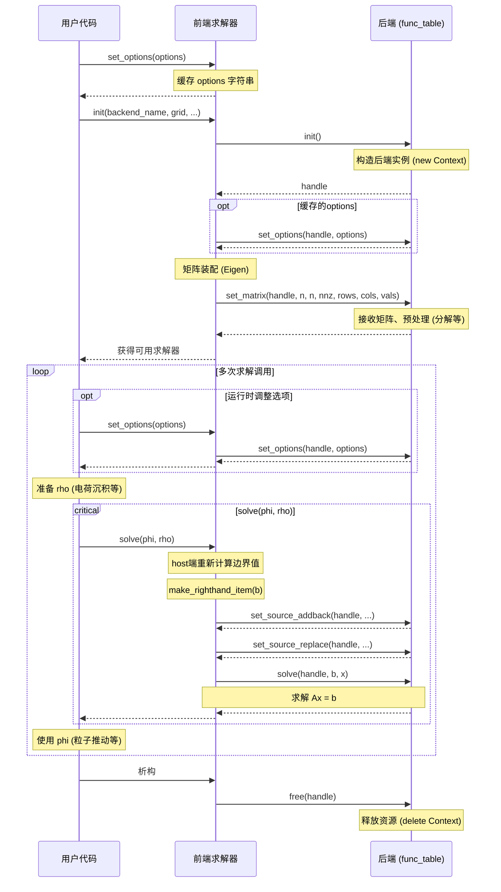

[English](field_solver_backend_en.md) | 中文

## 场求解器后端系统设计

### 概述

PSuM 的场求解器采用前后端分离架构：前端负责离散化、稀疏矩阵构造和边界条件处理；后端负责具体线性方程组的求解。
通过 C ABI 函数表接口，开发者可以无需修改前端代码即可接入自定义求解器。

现有的设计中，稀疏线性系统中系数矩阵是显式存在的；文档内容不适合作为 matrix-free 求解器的开发指引。

#### 前端求解器类型

PSuM 提供三类前端求解器，适用于不同的网格类型和应用场景：

| 前端求解器 | 网格类型 | 离散方法 | 适用场景 |
|-----------|---------|---------|---------|
| `Poisson_solver_2d/3d` | `simple_grid<2/3>` | 交错网格有限差分 (FDM) | 结构化网格，2D/3D |
| `FEM_Poisson_solver_2d` | `tri_mesh` | 有限元 (FEM) | 非结构化三角网格 |
| `MPG_Poisson_solver_2d` | `multi_patch_grid<2>` | 有限元 (FEM) | 多分辨率网格, 基于 FEM 求解器 |

当前版本的前端求解器范围即上表所列; FEM_3D/MPG_3D/Maxwell_solver_3d 等预计将包含在未来版本中。
前端求解器的离散方式和所求解的问题都是不可假定的, 但通过有限的接口与后端交互。

#### 整体架构图

*这个图里略去了前端内置的 native 求解器*



#### 前端与后端的交互流程

前端求解器内部使用 Eigen 稀疏矩阵进行矩阵装配，最终以 COO 格式通过统一的 `solver_backend` 接口与后端交互：

```
1. 前端配置时: 离散化 → 生成系数矩阵 A 和右端项 b; 创建后端示例
2. 前端配置时: 调用 backend.set_matrix(A) → 以 COO 格式传递矩阵
3. 前端求解时: 调用 backend.set_source_replace/addback() → 传递边界修正
4. 前端求解时: 调用 backend.solve(b, x) → 求解并返回结果
```

#### 完整生命周期序列



#### 调用约束

| 函数 | 调用次数 | 调用时机 |
|------|---------|---------|
| `init()` | 1 次 | 程序启动或求解器构造时 |
| `set_options()` | 0 或多次 | 前端：`init()` 前或随时; 部分后端需求 `set_matrix()` 前 |
| `set_matrix()` | 1 次 | `init()` 内部调用，矩阵装配完成后 |
| `set_source_addback()` | 每次 `solve()` 前 | 在 `make_righthand_item()` 中调用 |
| `set_source_replace()` | 每次 `solve()` 前 | 在 `make_righthand_item()` 中调用，**在 `addback` 之后** |
| `solve()` | 多次 | 时间步进循环中 |
| `free()` | 1 次 | `solver_backend` 析构时 |

### C ABI 接口规范

所有后端必须实现 `func_table` 中定义的 7 个函数。接口定义位于 `src/field_solver/register/interface.h`。

除 `register_solver` 外，`interface.h` 还导出了查询函数：

```c
// 根据名称查询后端函数表；若未找到，返回 init=nullptr 的空表
EXPORT func_table get_solver_funcs(const char* name);
```

前端通过 `solver_backend` 封装类, 获得后端示例。

#### 类型定义

```c
typedef void* psum_field_solver_handle;
```

后端实例的不透明指针。每个后端可以将其转换为自己的上下文结构体。

#### 函数签名

```c
// 创建求解器实例，返回句柄
typedef psum_field_solver_handle (*solver_init_func)();

// 设置系数矩阵（COO 格式）
// handle: 后端实例句柄
// n_row, n_col: 矩阵维度
// nnz: 非零元素数量
// rows, cols, vals: COO 格式的行索引、列索引、值数组
typedef void (*solver_set_matrix_func)(
    psum_field_solver_handle handle,
    unsigned long long n_row,
    unsigned long long n_col,
    unsigned long long nnz,
    unsigned long long* rows,
    unsigned long long* cols,
    double* vals
);

// 求解线性系统 Ax = b
// handle: 后端实例句柄
// b: 右端项数组（输入）
// x: 解数组（输出）
typedef void (*solver_solve_func)(
    psum_field_solver_handle handle,
    double* b,
    double* x
);

// 设置后端特定选项（可选）
// handle: 后端实例句柄
// options: 选项字符串
typedef void (*solver_set_options_func)(
    psum_field_solver_handle handle,
    const char* options
);
```

`set_options` 具有两种调用路径：

- **init 前**：前端缓存 options 字符串，在 `init()` 时自动传递给后端。
部分后端（如 `eigen_multigrid_cpu`）要求在 `set_matrix()` 前收到 options 以正确初始化；对于这种情况，必须在前端 init()前调用 `set_options()`。
- **init 后**：前端直接将 options 传递给后端，后端可据此进行运行时调整。

```c
// 需要原地替换的源项分量
// handle: 后端实例句柄
// size: 替换项数量
// idxs: 需要替换的索引数组
// new_values: 新值数组
typedef void (*solver_set_source_replace_func)(
    psum_field_solver_handle handle,
    unsigned long long size,
    unsigned long long* idxs,
    double* new_values
);

// 需要累加修正的源项分量
// handle: 后端实例句柄
// size: 累加项数量
// idxs: 需要累加的索引数组
// add_values: 累加值数组
typedef void (*solver_set_source_addback_func)(
    psum_field_solver_handle handle,
    unsigned long long size,
    unsigned long long* idxs,
    double* add_values
);

// 释放求解器实例
typedef void (*solver_free_func)(psum_field_solver_handle handle);
```

#### 函数表结构

```c
struct func_table {
    solver_init_func init;
    solver_set_matrix_func set_matrix;
    solver_solve_func solve;
    solver_set_options_func set_options;
    solver_set_source_replace_func set_source_replace;
    solver_set_source_addback_func set_source_addback;
    solver_free_func free;
};
```

#### solver_backend 封装类

`solver_backend`（定义于 `src/field_solver/backend.hpp`）是对 C ABI 函数表的 C++ RAII 封装，前端求解器通过此类与后端交互：

```cpp
class solver_backend {
    psum_field_solver_handle handle;
    func_table funcs;
public:
    solver_backend();                      // 空构造
    solver_backend(const char* kind);      // 按名称创建后端实例
    ~solver_backend();                     // 自动调用 free()

    // 移动语义，禁止拷贝
    solver_backend(solver_backend&&) noexcept;
    solver_backend& operator=(solver_backend&&) noexcept;

    void set_matrix(...);
    void solve(double* b, double* x);
    void set_options(const char* options);
    void set_source_replace(...);
    void set_source_addback(...);
    bool is_null() const;
};
```

**职责**：
- 构造时调用 `get_solver_funcs` 获取函数表，再调用 `init()` 创建后端实例
- 析构时自动调用 `free()` 释放资源
- 各成员函数转发至函数表对应函数，并做空指针检查

#### 源项修正语义

`set_source_addback` 和 `set_source_replace` 本质上是对右端项 `b` 做**轻量级的线性变换**：

```
set_source_addback:  rhs[idx] += value   (累加修正)
set_source_replace:  rhs[idx]  = value   (原地替换)
```

这两项操作都传入稀疏表示, 长度一般远低于完整的 `b` 向量。

**前端调用顺序**

```
1. set_source_addback(...)   // 先累加 Robin/Neumann 贡献
2. set_source_replace(...)   // 再替换 Dirichlet 值（覆盖之前的累加）
3. solve(b, x)
```

**注意事项**：
- `set_source_replace` 传入的索引被假定为不重复；`set_source_addback` 传入的索引若重复则需实现累加效果。
- 有的离散方式下不能简单地通过修改 `b` 来设置边界条件(如矩阵乘法)，此时由前端负责进行更复杂的源项构造。
- 后端需根据自身的指针位置假设（主机端或设备端）提供准确的实现; 源项修正调用的输入参数始终是 host 端数据，后端需自行处理数据搬运。

### 实现新后端的步骤

#### 1. 创建后端源文件

在 `src/field_solver/implements/` 目录下创建新的 `.cpp` 或 `.cu` 文件。文件名将成为后端的默认注册名。

#### 2. 定义上下文结构体

```cpp
struct MySolverContext {
    // 求解器内部状态
    // 例如：矩阵数据、预分配缓冲区、设备内存等
    
    // 源项修正数据
    std::vector<unsigned long long> source_replace_idxs;
    std::vector<double> source_replace_values;
    std::vector<unsigned long long> source_addback_idxs;
    std::vector<double> source_addback_values;
};
```

#### 3. 实现 7 个接口函数

**init 函数：**
```cpp
psum_field_solver_handle init() {
    return new MySolverContext();
}
```

**set_matrix 函数：**
```cpp
void set_matrix(psum_field_solver_handle h, 
                unsigned long long n_row, unsigned long long n_col,
                unsigned long long nnz,
                unsigned long long* rows, unsigned long long* cols, 
                double* vals) {
    MySolverContext* ctx = static_cast<MySolverContext*>(h);
    // 将 COO 格式转换为内部格式
    // 例如：CSR 格式、稠密矩阵、GPU 内存等
    // 执行预分解（如 LU、Cholesky）
}
```

**set_options 函数**
```cpp
void set_options(psum_field_solver_handle h, const char* options) {
    MySolverContext* ctx = static_cast<MySolverContext*>(h);
    // 解析选项字符串（可选）
}
```

**set_source_replace 和 set_source_addback 函数：**
```cpp
void set_source_replace(psum_field_solver_handle h, 
                        unsigned long long size, 
                        unsigned long long* idxs, 
                        double* new_values) {
    MySolverContext* ctx = static_cast<MySolverContext*>(h);
    // 只暂存; 使用推迟到solve阶段
    ctx->source_replace_idxs.assign(idxs, idxs + size);
    ctx->source_replace_values.assign(new_values, new_values + size);
}

// 如果idxs 中有重复的索引，则累加
void set_source_addback(psum_field_solver_handle h, 
                        unsigned long long size, 
                        unsigned long long* idxs, 
                        double* add_values) {
    MySolverContext* ctx = static_cast<MySolverContext*>(h);
    // 只暂存; 使用推迟到solve阶段
    ctx->source_addback_idxs.assign(idxs, idxs + size);
    ctx->source_addback_values.assign(add_values, add_values + size);
}
```

**solve 函数：**
```cpp
void solve(psum_field_solver_handle h, double* b, double* x) {
    MySolverContext* ctx = static_cast<MySolverContext*>(h);
    
    // 1. 应用 source addback
    // 2. 应用 source replace
    // 具体实现需考虑b, x是device memory还是host memory
    
    // 3. 求解 Ax = b
    // 将结果写入 x
}
```

**free 函数：**
```cpp
void solver_free(psum_field_solver_handle h) {
    delete static_cast<MySolverContext*>(h);
}
```

#### 4. 注册后端

使用静态初始化器在程序启动时自动注册：

```cpp
static int _ = []() {
    func_table table;
    table.init = init;
    table.set_matrix = set_matrix;
    table.solve = solve;
    table.set_options = set_options;
    table.set_source_replace = set_source_replace;
    table.set_source_addback = set_source_addback;
    table.free = solver_free;
    register_solver("my_solver_name", table);
    return 0;
}();
```

约定: 后端名称为 `platform_algorithm_device` 的形式.
其中, `platform` 为主要依赖的软件平台名称, 如`cuda`, `eigen`, `sycl`; 
`algorithm` 为算法名称, 如`sparse_lu`, `multigrid`, `gmres`, `pcg`; 
`device` 为设备类型 (限定为`cpu` 或 `gpu`).

### 构建和集成

#### 目录结构

```
src/field_solver/
├── register/
│   ├── interface.h          # C ABI 接口定义
│   └── registry.cpp         # 注册表实现
├── backend.hpp              # solver_backend C++ 封装类
├── implements/
│   ├── eigen_sparselu_cpu.cpp
│   ├── eigen_multigrid_cpu.cpp
│   ├── cuda_sparselu_gpu.cu
│   └── multigrid/           # 多重网格求解器相关算法
└── makefile                 # 编译规则

编译产物：
src/field_solver/bin/
├── registry.o               # 注册表
├── eigen_sparselu_cpu.o     # 各后端目标文件
├── eigen_multigrid_cpu.o
├── cuda_sparselu_gpu.o
├── ...
└── impls.o                  # 所有后端合并后的目标文件
```

#### 1. 修改构建配置

在 `config.mk` 中添加新后端的编译开关：

```makefile
# 添加新后端开关
USE_NEW_BACKEND ?= 1

# 在后端列表中添加
ifeq ($(USE_NEW_BACKEND), 1)
    PSUM_FIELD_SOLVER_BACKENDS += $(FIELD_SOLVER_BIN)/new_backend.o
endif
```

#### 2. 编译后端

后端编译部分参数需由`./config.mk`决定.
```bash
# CPU 后端 (.cpp)
$(CXX) -O3 -std=c++20 -fopenmp -c $< -fPIC -o $@

# GPU 后端 (.cu)
$(NVCC) -O3 -std=c++20 -Xcompiler -fPIC -arch=sm_75 -c $< -o $@

# 编译所有后端
cd src/field_solver && make

# 或者编译整个项目
./build.sh
```

#### 3. 链接后端

所有后端 `.o` 文件通过 `ld -r` 合并为 `impls.o`，用户只需链接 `registry.o` 和 `impls.o`。

在用户程序的 Makefile 中，使用 `$(USE_BACKENDS)` 宏链接后端：

```makefile
# config.mk 中定义
USE_BACKENDS = -Wl,--whole-archive \
    $(FIELD_SOLVER_BIN)/registry.o \
    $(FIELD_SOLVER_BIN)/impls.o \
    -Wl,--no-whole-archive

# 用户程序
include /path/to/psum/config.mk

my_app: my_app.cpp
	$(CXX) $(COMMON_FLAGS) my_app.cpp $(USE_BACKENDS) $(LIBS) -o my_app
```

**`--whole-archive` 的作用**：确保静态初始化器（`static int _ = [](){...}()`）在 `main()` 之前被执行，从而完成后端注册。如果不使用 `--whole-archive`，链接器可能丢弃"未使用"的后端代码。

### 注意事项

1. **内存管理**：`init()` 分配的内存必须在 `free()` 中释放。前端保证 `free()` 会被调用。

2. **线程安全**：backend 实例不必是线程安全的, 也不能被视作线程安全的。

3. **数据位置**：backend 的 solve 函数中传入的指针所在的位置是被假定的, 并由前端和用户确保其有效性。
set_source_replace/addback 函数中传入的指针是 host 端的, backend 的实现需确保作用在源项数据上。

4. **源项微调语义**: `set_source_replace` 传入的索引被假定为不重复; `set_source_addback` 传入的索引如重复则实现累加效果。详见[源项修正语义](#源项修正语义)。

### 现有后端参考

PSuM 内置的 native 求解器及部分后端实现：

| 后端名 | 文件 | 特点 | 适用场景 |
|--------|------|------|---------|
| `native` | 内置于前端 | 2D: SparseLU 直接法；3D: BiCGSTAB 迭代法 | 小规模问题、调试 |
| `eigen_sparselu_cpu` | `implements/eigen_sparselu_cpu.cpp` | CPU 稀疏 LU 直接法 | 中小规模、高精度 |
| `eigen_multigrid_cpu` | `implements/eigen_multigrid_cpu.cpp` | CPU 多重网格迭代法 | 大规模问题、快速求解 |
| `cuda_sparselu_gpu` | `implements/cuda_sparselu_gpu.cu` | GPU 稀疏 LU（cuSPARSE + UMFPACK） | GPU 加速、大规模 |