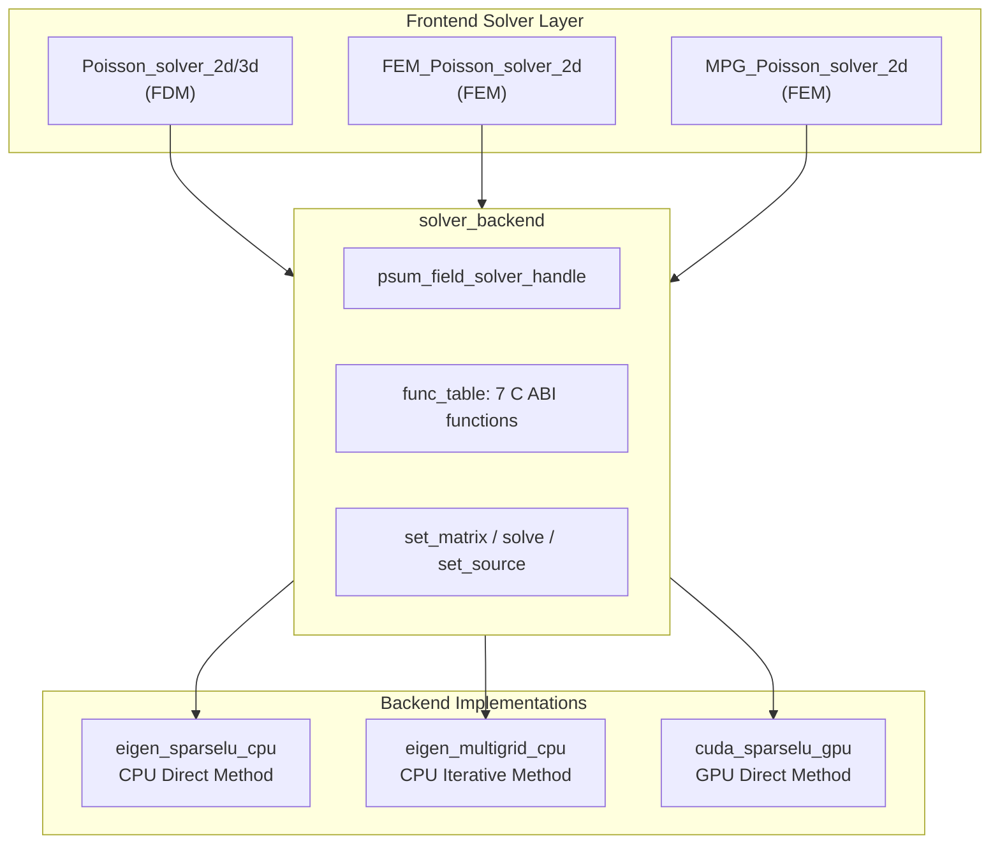
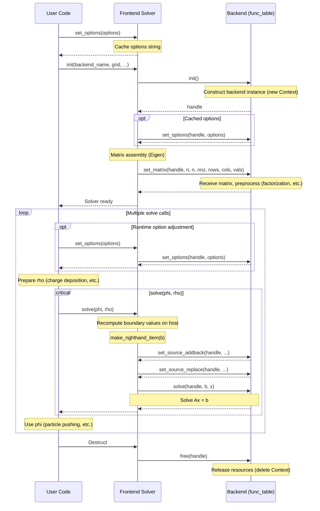

English | [中文](field_solver_backend.md)

## Field Solver Backend System Design

### Overview

PSuM's field solver adopts a frontend-backend separated architecture: the frontend is responsible for discretization, sparse matrix construction, and boundary condition processing; the backend is responsible for solving the specific linear system of equations.

Through the C ABI function table interface, developers can integrate custom solvers without modifying any frontend code.

In the current design, the coefficient matrix of the sparse linear system exists explicitly; the content of this document is not suitable as a development guide for matrix-free solvers.

#### Frontend Solver Types

PSuM provides three types of frontend solvers for different grid types and application scenarios:

| Frontend Solver | Grid Type | Discretization Method | Applicable Scenarios |
|-----------|---------|---------|---------|
| `Poisson_solver_2d/3d` | `simple_grid<2/3>` | Staggered-grid finite difference (FDM) | Structured grids, 2D/3D |
| `FEM_Poisson_solver_2d` | `tri_mesh` | Finite element (FEM) | Unstructured triangular meshes |
| `MPG_Poisson_solver_2d` | `multi_patch_grid<2>` | Finite element (FEM) | Multi-resolution grids, FEM-based solver |

Additional frontend solvers such as FEM_3D/MPG_3D/Maxwell_solver_3d will be implemented in the future.
The discretization method and the problem being solved by a frontend solver are not assumable, but they interact with the backend through a finite set of interfaces.

#### Overall Architecture Diagram

*The native solver built into the frontend is omitted from this diagram.*



#### Frontend-Backend Interaction Flow

The frontend solver internally uses Eigen sparse matrices for matrix assembly, and ultimately interacts with the backend through the unified `solver_backend` interface in COO format:

```
1. Frontend configuration: Discretize → generate coefficient matrix A and right-hand side b; create backend instance
2. Frontend configuration: Call backend.set_matrix(A) → transfer matrix in COO format
3. Frontend solve phase: Call backend.set_source_replace/addback() → transfer boundary corrections
4. Frontend solve phase: Call backend.solve(b, x) → solve and return results
```

#### Complete Lifecycle Sequence



#### Call Constraints

| Function | Call Count | Call Timing |
|------|---------|---------|
| `init()` | 1 time | Program startup or solver construction |
| `set_options()` | 0 or more times | Frontend: before `init()` or anytime; some backends require before `set_matrix()` |
| `set_matrix()` | 1 time | Called inside `init()`, after matrix assembly |
| `set_source_addback()` | Before each `solve()` | Called in `make_righthand_item()` |
| `set_source_replace()` | Before each `solve()` | Called in `make_righthand_item()`, **after addback** |
| `solve()` | Multiple times | In the time-stepping loop |
| `free()` | 1 time | On `solver_backend` destruction |

### C ABI Interface Specification

All backends must implement the 7 functions defined in `func_table`. The interface definition is located at `src/field_solver/register/interface.h`.

In addition to `register_solver`, `interface.h` also exports a query function:

```c
// Query backend function table by name; if not found, returns an empty table with init=nullptr
EXPORT func_table get_solver_funcs(const char* name);
```

The frontend obtains backend instances through the `solver_backend` wrapper class.

#### Type Definitions

```c
typedef void* psum_field_solver_handle;
```

An opaque pointer to the backend instance. Each backend can cast it to its own context structure.

#### Function Signatures

```c
// Create solver instance, return handle
typedef psum_field_solver_handle (*solver_init_func)();

// Set coefficient matrix (COO format)
// handle: backend instance handle
// n_row, n_col: matrix dimensions
// nnz: number of non-zero elements
// rows, cols, vals: COO format row indices, column indices, value arrays
typedef void (*solver_set_matrix_func)(
    psum_field_solver_handle handle,
    unsigned long long n_row,
    unsigned long long n_col,
    unsigned long long nnz,
    unsigned long long* rows,
    unsigned long long* cols,
    double* vals
);

// Solve linear system Ax = b
// handle: backend instance handle
// b: right-hand side array (input)
// x: solution array (output)
typedef void (*solver_solve_func)(
    psum_field_solver_handle handle,
    double* b,
    double* x
);

// Set backend-specific options (optional)
// handle: backend instance handle
// options: options string
typedef void (*solver_set_options_func)(
    psum_field_solver_handle handle,
    const char* options
);
```

`set_options` has two call paths:

- **Before init**: The frontend caches the options string and automatically passes it to the backend during `init()`.
Some backends (e.g., `eigen_multigrid_cpu`) require receiving options before `set_matrix()` to initialize correctly; in such cases, `set_options()` must be called before the frontend's `init()`.
- **After init**: The frontend passes options directly to the backend, which can use them for runtime adjustments.

```c
// Source term components to be replaced in-place
// handle: backend instance handle
// size: number of replacement entries
// idxs: index array for replacement
// new_values: new value array
typedef void (*solver_set_source_replace_func)(
    psum_field_solver_handle handle,
    unsigned long long size,
    unsigned long long* idxs,
    double* new_values
);

// Source term components to be accumulated
// handle: backend instance handle
// size: number of accumulation entries
// idxs: index array for accumulation
// add_values: accumulation value array
typedef void (*solver_set_source_addback_func)(
    psum_field_solver_handle handle,
    unsigned long long size,
    unsigned long long* idxs,
    double* add_values
);

// Release solver instance
typedef void (*solver_free_func)(psum_field_solver_handle handle);
```

#### Function Table Structure

```c
struct func_table {
    solver_init_func init;
    solver_set_matrix_func set_matrix;
    solver_solve_func solve;
    solver_set_options_func set_options;
    solver_set_source_replace_func set_source_replace;
    solver_set_source_addback_func set_source_addback;
    solver_free_func free;
};
```

#### solver_backend Wrapper Class

`solver_backend` (defined in `src/field_solver/backend.hpp`) is a C++ RAII wrapper around the C ABI function table. Frontend solvers interact with backends through this class:

```cpp
class solver_backend {
    psum_field_solver_handle handle;
    func_table funcs;
public:
    solver_backend();                      // Empty constructor
    solver_backend(const char* kind);      // Create backend instance by name
    ~solver_backend();                     // Automatically calls free()

    // Move semantics, copy disabled
    solver_backend(solver_backend&&) noexcept;
    solver_backend& operator=(solver_backend&&) noexcept;

    void set_matrix(...);
    void solve(double* b, double* x);
    void set_options(const char* options);
    void set_source_replace(...);
    void set_source_addback(...);
    bool is_null() const;
};
```

**Responsibilities**:
- On construction, calls `get_solver_funcs` to obtain the function table, then calls `init()` to create the backend instance
- On destruction, automatically calls `free()` to release resources
- Each member function forwards to the corresponding function in the function table, with null pointer checks

#### Source Term Correction Semantics

`set_source_addback` and `set_source_replace` are essentially **lightweight linear transformations** on the right-hand side vector `b`:

```
set_source_addback:  rhs[idx] += value   (accumulation correction)
set_source_replace:  rhs[idx]  = value   (in-place replacement)
```

Both operations are passed in sparse representation, with lengths typically far smaller than the full `b` vector.

**Frontend Call Order**

```
1. set_source_addback(...)   // First accumulate Robin/Neumann contributions
2. set_source_replace(...)   // Then replace Dirichlet values (overwrites previous accumulations)
3. solve(b, x)
```

**Important Notes**:
- Indices passed to `set_source_replace` are assumed to be non-duplicate; indices passed to `set_source_addback` that are duplicated must implement accumulation behavior.
- Some discretization methods cannot set boundary conditions by simply modifying `b` (e.g., matrix multiplication); in such cases, the frontend is responsible for more complex source term construction.
- The backend must provide correct implementations based on its own pointer location assumptions (host or device); input parameters for source term correction calls are always host-side data, and the backend must handle data transfer itself.

### Steps to Implement a New Backend

#### 1. Create Backend Source File

Create a new `.cpp` or `.cu` file in the `src/field_solver/implements/` directory. The filename will become the default registration name for the backend.

#### 2. Define Context Structure

```cpp
struct MySolverContext {
    // Solver internal state
    // e.g.: matrix data, pre-allocated buffers, device memory, etc.
    
    // Source term correction data
    std::vector<unsigned long long> source_replace_idxs;
    std::vector<double> source_replace_values;
    std::vector<unsigned long long> source_addback_idxs;
    std::vector<double> source_addback_values;
};
```

#### 3. Implement the 7 Interface Functions

**init function:**
```cpp
psum_field_solver_handle init() {
    return new MySolverContext();
}
```

**set_matrix function:**
```cpp
void set_matrix(psum_field_solver_handle h, 
                unsigned long long n_row, unsigned long long n_col,
                unsigned long long nnz,
                unsigned long long* rows, unsigned long long* cols, 
                double* vals) {
    MySolverContext* ctx = static_cast<MySolverContext*>(h);
    // Convert COO format to internal format
    // e.g.: CSR format, dense matrix, GPU memory, etc.
    // Perform pre-factorization (e.g., LU, Cholesky)
}
```

**set_options function:**
```cpp
void set_options(psum_field_solver_handle h, const char* options) {
    MySolverContext* ctx = static_cast<MySolverContext*>(h);
    // Parse options string (optional)
}
```

**set_source_replace and set_source_addback functions:**
```cpp
void set_source_replace(psum_field_solver_handle h, 
                        unsigned long long size, 
                        unsigned long long* idxs, 
                        double* new_values) {
    MySolverContext* ctx = static_cast<MySolverContext*>(h);
    // Only store temporarily; usage is deferred to the solve phase
    ctx->source_replace_idxs.assign(idxs, idxs + size);
    ctx->source_replace_values.assign(new_values, new_values + size);
}

// If idxs contains duplicate indices, accumulate
void set_source_addback(psum_field_solver_handle h, 
                        unsigned long long size, 
                        unsigned long long* idxs, 
                        double* add_values) {
    MySolverContext* ctx = static_cast<MySolverContext*>(h);
    // Only store temporarily; usage is deferred to the solve phase
    ctx->source_addback_idxs.assign(idxs, idxs + size);
    ctx->source_addback_values.assign(add_values, add_values + size);
}
```

**solve function:**
```cpp
void solve(psum_field_solver_handle h, double* b, double* x) {
    MySolverContext* ctx = static_cast<MySolverContext*>(h);
    
    // 1. Apply source addback
    // 2. Apply source replace
    // Implementation must consider whether b, x are device or host memory
    
    // 3. Solve Ax = b
    // Write results to x
}
```

**free function:**
```cpp
void solver_free(psum_field_solver_handle h) {
    delete static_cast<MySolverContext*>(h);
}
```

#### 4. Register the Backend

Use a static initializer to automatically register at program startup:

```cpp
static int _ = []() {
    func_table table;
    table.init = init;
    table.set_matrix = set_matrix;
    table.solve = solve;
    table.set_options = set_options;
    table.set_source_replace = set_source_replace;
    table.set_source_addback = set_source_addback;
    table.free = solver_free;
    register_solver("my_solver_name", table);
    return 0;
}();
```

Convention: Backend names follow the `platform_algorithm_device` format.
Here, `platform` is the name of the primary software dependency, such as `cuda`, `eigen`, `sycl`;
`algorithm` is the algorithm name, such as `sparse_lu`, `multigrid`, `gmres`, `pcg`;
`device` is the device type (limited to `cpu` or `gpu`).

### Build and Integration

#### Directory Structure

```
src/field_solver/
├── register/
│   ├── interface.h          # C ABI interface definitions
│   └── registry.cpp         # Registry implementation
├── backend.hpp              # solver_backend C++ wrapper class
├── implements/
│   ├── eigen_sparselu_cpu.cpp
│   ├── eigen_multigrid_cpu.cpp
│   ├── cuda_sparselu_gpu.cu
│   └── multigrid/           # Multigrid solver related algorithms
└── makefile                 # Build rules

Build artifacts:
src/field_solver/bin/
├── registry.o               # Registry
├── eigen_sparselu_cpu.o     # Individual backend object files
├── eigen_multigrid_cpu.o
├── cuda_sparselu_gpu.o
├── ...
└── impls.o                  # Merged object file of all backends
```

#### 1. Modify Build Configuration

Add the build switch for the new backend in `config.mk`:

```makefile
# Add new backend switch
USE_NEW_BACKEND ?= 1

# Add to backend list
ifeq ($(USE_NEW_BACKEND), 1)
    PSUM_FIELD_SOLVER_BACKENDS += $(FIELD_SOLVER_BIN)/new_backend.o
endif
```

#### 2. Compile Backend

Some compilation parameters for the backend are determined by `./config.mk`.
```bash
# CPU backend (.cpp)
$(CXX) -O3 -std=c++20 -fopenmp -c $< -fPIC -o $@

# GPU backend (.cu)
$(NVCC) -O3 -std=c++20 -Xcompiler -fPIC -arch=sm_75 -c $< -o $@

# Compile all backends
cd src/field_solver && make

# Or build the entire project
./build.sh
```

#### 3. Link Backend

All backend `.o` files are merged into `impls.o` via `ld -r`. Users only need to link `registry.o` and `impls.o`.

In the user program's Makefile, use the `$(USE_BACKENDS)` macro to link backends:

```makefile
# Defined in config.mk
USE_BACKENDS = -Wl,--whole-archive \
    $(FIELD_SOLVER_BIN)/registry.o \
    $(FIELD_SOLVER_BIN)/impls.o \
    -Wl,--no-whole-archive

# User program
include /path/to/psum/config.mk

my_app: my_app.cpp
	$(CXX) $(COMMON_FLAGS) my_app.cpp $(USE_BACKENDS) $(LIBS) -o my_app
```

**Purpose of `--whole-archive`**: Ensures that static initializers (`static int _ = [](){...}()`) are executed before `main()`, thereby completing backend registration. Without `--whole-archive`, the linker may discard "unused" backend code.

### Important Notes

1. **Memory Management**: Memory allocated in `init()` must be released in `free()`. The frontend guarantees that `free()` will be called.

2. **Thread Safety**: Backend instances do not need to be thread-safe, nor should they be assumed to be thread-safe.

3. **Data Location**: The pointer locations passed to the backend's `solve` function are assumed, and the frontend and user must ensure their validity.
For pointers passed to `set_source_replace`/`set_source_addback` functions, they are on the host side; the backend implementation must ensure the effects are applied to the source term data.

4. **Source Term Correction Semantics**: Indices passed to `set_source_replace` are assumed to be non-duplicate; indices passed to `set_source_addback` must implement accumulation behavior. See [Source Term Correction Semantics](#source-term-correction-semantics) for details.

### Existing Backend Reference

PSuM's built-in native solvers and some backend implementations:

| Backend Name | File | Characteristics | Applicable Scenarios |
|--------|------|------|---------|
| `native` | Built into frontend | 2D: SparseLU direct method; 3D: BiCGSTAB iterative method | Small-scale problems, debugging |
| `eigen_sparselu_cpu` | `implements/eigen_sparselu_cpu.cpp` | CPU sparse LU direct method | Small to medium scale, high precision |
| `eigen_multigrid_cpu` | `implements/eigen_multigrid_cpu.cpp` | CPU multigrid iterative method | Large-scale problems, fast solving |
| `cuda_sparselu_gpu` | `implements/cuda_sparselu_gpu.cu` | GPU sparse LU (cuSPARSE + UMFPACK) | GPU acceleration, large-scale |
