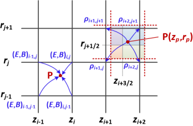

[English](pic_en.md) | 中文

## PIC 简介

等离子体是由海量带电粒子组成的，这些粒子之间通过电磁场进行复杂的、长程的集体相互作用。等离子体的行为十分复杂，是一个真正的非局域、非平衡、非线性系统(*此提法见于[Taccogna,2018](https://doi.org/10.1088/1361-6463/aaa317)*)。Particle-in-Cell (PIC) 的核心使命就是给出一种计算量可控、又能尽量捕捉所有等离子体过程的计算方法。

相比其他（潜在的）几种计算方法，PIC 有其不可替代性：

- 相比流体模型：流体模型中，等离子体被视为连续流体（如磁流体动力学, MHD），流体模型适用于描述大尺度、低频率的现象。然而，当粒子的动理学效应（kinetic effects）变得重要时，流体模型就失效了。这些效应包括：非麦克斯韦速度分布（例如粒子束）、波-粒相互作用（如朗道阻尼）、以及在边界（鞘层）处的行为。

- 相比直接求解 N 体问题： 直接模拟万亿个真实粒子间的“N 体”相互作用在计算上是绝对不可能的。一些电磁场边界条件的处理也会变得困难。

- 相比直接求解动理学方程：描述等离子体动理学行为的 Vlasov 方程是在一个六维相空间（3 个空间维+3 个速度维）中定义的偏微分方程。直接在这样的高维网格上求解该方程（称为欧拉方法或 Vlasov 模拟）的计算成本极高。这种方案并非完全不可行，但到目前为止适用范围仍然十分受限。

虽然计算成本仍然很高，但 PIC 已成为模拟等离子体行为的一种实用、可靠的方法。

### 弗拉索夫-泊松系统

弗拉索夫-泊松（Vlasov-Poisson）系统是描述等离子体动理学行为的最基本模型。它是 PIC 模拟的经典起点，尤其适用于研究**静电**现象。

在 3 维空间中，该系统包含两个方程：

1. 弗拉索夫方程（Vlasov Equation）：
描述粒子分布函数 $f_s$ （$s$ 代表不同粒子种类，如电子 $e$ 和离子 $i$）如何在自洽的电场 $\mathbf{E}$ 中演化。它是一个 6 维的偏微分方程：

$$\frac{\partial f_s}{\partial t} + \mathbf{v} \cdot \nabla_{\mathbf{x}} f_s + \frac{q_s}{m_s}\mathbf{E} \cdot \nabla_{\mathbf{v}} f_s = 0 \tag{1}$$

2. 泊松方程（Poisson's Equation）：
描述电场 $\mathbf{E}$ 是如何由所有粒子的空间分布（即电荷密度 $\rho$）产生的。在静电假设下，电场 $\mathbf{E}$ 可以表示为电势 $\phi$ 的梯度（$\mathbf{E} = -\nabla \phi$），从而得到泊松方程。它是一个 3 维的偏微分方程：

$$\nabla^2 \phi = -\frac{\rho}{\epsilon_0} \tag{2}$$

这两个方程通过电荷密度 $\rho$ 耦合在一起。$\rho$ 是从所有粒子种类的分布函数 $f_s$ 中积分得到的：

$$\rho(\mathbf{x}, t) = \sum_s q_s \int f_s(\mathbf{x}, \mathbf{v}, t) d\mathbf{v} \tag{3}$$

这三个方程就是从动理学视角描述等离子体的三个基本要素：
- 分布函数在给定电场下随时间发生演化；
- 自由电荷的空间分布决定了电场的空间分布；
- 分布函数的速度空间积分决定了电荷分布。

将泊松方程替换为麦克斯韦方程，就可以得到物理上更正确的模型；不过对于许多问题，泊松方程就足够了。

### 两种视角：宏粒子与特征线

等离子体由大量相互作用的微观带电粒子组成，作为一个 N 体系统，巨大的 N（通常远超 10^12）直接导致了计算的不可行。PIC 中（通常）并不是在追踪每一个真实的电子或离子。相反，它追踪的是**宏粒子**：一个宏粒子代表了位置、速度相近的一大群真实粒子（例如 $10^6$ 或 $10^{10}$ 个电子）。想象一下，将原本的等离子体中的粒子替换成数目小得多、但保持电荷和质量守恒的宏粒子，大部分物理现象应当保持不变。

我们假设这个宏粒子拥有它所代表的那群粒子的总电荷和总质量，并位于它们的平均位置 $\mathbf{x}_j$。然后，我们通过牛顿第二定律计算这个宏粒子的运动：

$$\frac{d\mathbf{x}_j}{dt} = \mathbf{v}_j$$

$$\frac{d\mathbf{v}_j}{dt} = \frac{q_j}{m_j} (\mathbf{E}(\mathbf{x}_j) + \mathbf{v}_j \times \mathbf{B}(\mathbf{x}_j))$$

可以认为 PIC 实际求解的是这个宏粒子体系的演化。通过追踪每一个宏粒子的运动，也就能够计算等离子体整体的演化。

上面描述的是一种直观的理解 PIC 的方式。在理论分析中，另一种视角也同样有意义：回顾 Vlasov 方程，它描述了分布函数 $f(\mathbf{x}, \mathbf{v}, t)$ 在六维相空间中的演化，以最简单的无碰撞、静电情况为例：

$$\frac{\partial f}{\partial t} + \mathbf{v} \cdot \nabla_{\mathbf{x}} f + \frac{q}{m}\mathbf{E} \cdot \nabla_{\mathbf{v}} f = 0$$

这是一个偏微分方程。求解它的一种经典方法是**特征线法**（Method of Characteristics）。该方法告诉我们，沿着某条特定的相空间轨迹（即“特征线”），分布函数 $f$ 的值是恒定不变的。这些特征线由一组常微分方程定义：

$$\frac{d\mathbf{x^*}}{dt} = \mathbf{v^*}$$

$$\frac{d\mathbf{v^*}}{dt} = \frac{q}{m}\mathbf{E}(\mathbf{x^*}, t)$$

沿着轨迹$(\mathbf{x^*},\mathbf{v^*})$有：

$$f(\mathbf{x^*}_{t=0}, \mathbf{v^*}_{t=0}, t=0) = f(\mathbf{x^*}_{t=\tau}, \mathbf{v^*}_{t=\tau}, t=\tau)$$

因此，如果我们将初始分布$f_{t=0}$采样为一组 6 维相空间中的点，并将这些点的位置和速度作为特征线方程的初始条件，则这些点沿着特征线推进$\Delta t$后，就构成了$f_{t=\Delta t}$的一组采样！即：

$$
f_0 \xrightarrow{采样} {\left\{(\mathbf{x^*},\mathbf{v^*})_{t=0}\right\}} \xrightarrow{推动} {\left\{(\mathbf{x^*},\mathbf{v^*})_{t=\Delta t}\right\}} \xrightarrow{采样表示} f_{\Delta t}
$$

因此，通过沿特征线反复推动一组相空间中的点，我们就能以间接的方式表达分布函数的演化。请注意，特征线所满足的方程与我们用于推进宏粒子的运动学方程完全相同。在这种视角下，PIC 中的每一个宏粒子都是相空间分布的一个采样样本，而其满足的特征线方程恰是带电粒子的运动方程。这就是为什么 PIC 实际上也是一种动理学模拟方法。

对比我们想要求解的 Vlasov-Poisson 系统，PIC 提供了求解 Vlasov 方程的具体方法。具体来说：

- 分布函数的离散方式：每个带电粒子种群离散为一组宏粒子。
- 分布函数的更新：按带电粒子的运动方程更新宏粒子，就能模拟分布函数的演化。

### 粒子与场的耦合

Poisson 方程的离散化求解可选择有限差分、有限体积或有限元任一方法，不在此赘述。PIC 还需要解决 Vlasov 方程和 Poisson 方程的耦合问题。在标准的 PIC 方法中，通过交替求解这两个方程实施耦合，包括以下步骤：

- 粒子推进（Vlasov）： 插值获得宏粒子所在位置的电磁场，根据牛顿第二定律更新所有宏粒子的位置 $\mathbf{x}_j$ 和速度 $\mathbf{v}_j$。
- 电荷分配（积分）： 将所有宏粒子的电荷 $q_j$ 分配到空间网格点上，构建出网格化的电荷密度 $\rho$。这就是对方程(3)的数值实现。
- 场求解（Poisson）： 在网格上求解泊松方程 $\nabla^2 \phi = -\rho / \epsilon_0$，得到网格化的电势 $\phi$。并计算出网格上的电场 $\mathbf{E} = -\nabla \phi$。

循环执行这些步骤，就可以模拟等离子体的演化。不过，这里还有 2 个问题需要解决：

- 如何根据上一步计算的电场和粒子位置，获得*当地*的电场？
- 如何根据粒子的位置，获得此刻的电荷密度*空间分布*？

在标准的、结构化网格的 PIC 中，这两个问题的解答都是**面积权重法**，如下图所示：

即我们认为粒子具有和网格相同的形状，而每个格子与粒子面积相重合的部分决定了这个格子所贡献的权重。

需要强调，插值方案**不是唯一**的，且对 PIC 方法的整体数值特性影响很大。这仍是目前 PIC 方法研究的一个重要分支。