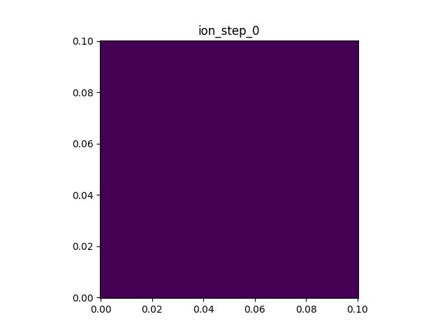

English | [中文](avalanche.md)

## Avalanche

This tutorial demonstrates the usage of the MCC collision module. High-speed electrons are placed in a 2D region with a Gaussian background gas cloud.
After entering the gas cloud, electrons undergo collisions: first elastic scattering changes their direction of flight; once ionization collisions are added, secondary electrons continue to collide and ionize, forming an avalanche cascade.

Modules, features, and typical usage covered:
- `particle_group` particle container and `for_each` traversal
- `node_field2D` / `host_node_field2D` device-side and host-side fields
- `add_back` particle→field deposition
- MCC collision model (elastic scattering + ionization collision)
- Secondary particle production and buffer mechanism



### Preparation

Create `avalanche.cpp` under `example/avalanche/`, then modify this file step by step following each stage.
`example/avalanche/stage_1.cpp` through `stage_5.cpp` are reference answers at the end of each stage, for comparison with your own code; they are not programs you need to run.

It is recommended to enter the example directory from the project root and load the build environment:

```bash
cd example/avalanche
source ../../env_load.sh
```

There may be leftover `.plt`, `.png`, or `.gif` files in `output/`.
You can manually clear `output/` first.

> **First-run speed**: AdaptiveCpp uses a JIT mechanism that compiles kernels on the first run, which increases the time. This example uses a small number of particles, so JIT overhead dominates; the first run after compilation does not reflect real performance.

### Stage 1: Particle Group and Basic Motion

In `avalanche.cpp`, first include the necessary headers and use the PSuM prelude:

```cpp
#include <iostream>
#include <fstream>
#include <Eigen/Core>
#include <psum/psum.hpp>

using namespace std;
using namespace psum::prelude;
```

Define the particle type. A particle here has position, velocity, and a random seed (the seed is not used in this stage; it is reserved for the Stage 3 collision module):

```cpp
using Particle = tagged_struct<
    tag_bind<property::position, Eigen::RowVector2d>,
    tag_bind<property::velocity, Eigen::RowVector2d>,
    tag_bind<property::random_seed, uint32_t>
>;

using PG = particle_group<Particle, pos_x_nan_is_invalid>;
```

`pos_x_nan_is_invalid` means that once a particle is marked invalid, `particle_group` traversal automatically skips it.

Add a particle push function that updates position with the Euler method and marks particles leaving the grid as invalid:

```cpp
void move_particles(PG& pg, const auto& grid, double dt) {
    pg.for_each([&](sycl::handler& h) {
        return [=](Particle& p) {
            tag::get<property::position>(p) += tag::get<property::velocity>(p) * dt;
            if (!grid.inGrid(tag::get<property::position>(p)))
                PG::validator::make_invalid(p);
        };
    });
}
```

In main, create the queue, grid, and particle container, and write a motion loop that injects one electron per time step, advances the motion, and periodically records the particle count to `count.plt`:

```cpp
int main() {
    sycl::queue q{sycl::default_selector_v};

    auto grid = simple_grid<2>({0.0, 0.0}, {0.1, 0.1}, {200, 200});

    PG electrons(q);

    ofstream count_file("output/count.plt");
    count_file << "variables=time,ele" << endl;

    double dt = 1e-10;
    int steps = 600, interval = 20;

    for (int step = 0; step <= steps; ++step) {
        move_particles(electrons, grid, dt);

        if (step % interval == 0) {
            count_file << step * dt << "\t" << electrons.size() << endl;
            cout << "step " << step << ": ele=" << electrons.size() << endl;
        }

        Particle p0;
        tag::get<property::position>(p0) = {0.001, 0.05};
        tag::get<property::velocity>(p0) = {6e6, 0.0};
        tag::get<property::random_seed>(p0) = global_random::rand_uint();
        electrons.insert({p0});
    }

    count_file.close();
    cout << "Avalanche stage 1: wrote count.plt." << endl;

    return 0;
}
```

Write the makefile:

```makefile
-include ../../config.mk

INCLUDES = -I ../../include -I ../../src

avalanche: avalanche.cpp
	$(ACPP) $(COMMON_FLAGS) $(INCLUDES) -o avalanche avalanche.cpp $(LIBS) $(LDFLAGS)
	mkdir -p output
	./avalanche
```

(These commands already exist in `example/avalanche/makefile`; just uncomment them.)

Each subsequent stage is compiled and run the same way:

```bash
make avalanche
```

After a successful run, the electron count in `count.plt` grows linearly at first, then settles into a steady state due to boundary absorption.

What you need to know at this stage:
- `tagged_struct` binds property names and types via tags, determining the memory layout at compile time.
- `for_each` operates on each particle using a two-layer lambda technique.
- Particles leaving the grid are marked invalid via `make_invalid` and automatically skipped by subsequent `for_each`.

The code state at the end of this stage can be found in `example/avalanche/stage_1.cpp`.

### Stage 2: Background Gas Cloud and Host-side Field

Continue modifying `avalanche.cpp` from Stage 1:
- Add a `host_node_field2D` host-side field and a `node_field2D` device-side field.
- Initialize a Gaussian argon gas density field on the host side.
- Copy to the device side and output visualization.

Add field type aliases near the top of the file:

```cpp
using Field = node_field2D<double>;
using HField = host_node_field2D<double>;
```

In main, after creating the particle container and before the motion loop, add the host-side background field initialization.
Assign values on the host-side background field with a Gaussian function, then `copy` to the device-side field:

```cpp
    PG electrons(q);

    Field atom_dens(q, grid);
    HField atom_host(grid);

    atom_host.setZero();
    Eigen::RowVector2d center{0.07, 0.05};
    double gas_r = 0.025;
    atom_host.for_each([&](size_t, double& v, const auto& pos) {
        v = 2e22 * exp(-((pos - center).squaredNorm() / gas_r / gas_r));
    });
    atom_host.plot("output/atom_dens.plt", "nAr", 0.0);
    atom_dens.copy(atom_host.getContent());
```

The host-side `for_each` iterates over each node; its parameters are the node index, a value reference, and a coordinate reference. Here it computes the Gaussian density directly from the coordinates.
> In fact, the same thing can be done with a device-side field using `for_each`; it just requires the two-layer lambda, which is slightly more cumbersome.

In the makefile, after running the program, convert `atom_dens.plt` into an image:

```makefile
avalanche: avalanche.cpp
	$(ACPP) $(COMMON_FLAGS) $(INCLUDES) -o avalanche avalanche.cpp $(LIBS) $(LDFLAGS)
	mkdir -p output
	./avalanche
	python3 ../pltview.py output/atom_dens.plt
```

Compile and run:

```bash
make avalanche
```

After running you should see: `output/atom_dens.png` (a static background gas cloud), and `count.plt` (electrons pass through the gas cloud with no collisions, same behavior as Stage 1).

What you need to know at this stage:
- The host-side field is used for initialization (assigning values node by node according to coordinates); once done, it is copied to the device side for the collision module to read.
- The background density field is the basis for MCC collision probability calculation — the higher the density, the greater the collision probability.

The code state at the end of this stage can be found in `example/avalanche/stage_2.cpp`.

### Stage 3: MCC Elastic Scattering

Continue modifying `avalanche.cpp` from Stage 2:
- Add the `Avalanche_mcc_model` struct; the `collide()` of the `col_ionization` collision type temporarily implements only the scattering redirection part (no new particles produced).
- Create multi-species particle groups (atoms, ions) and their corresponding density fields.
- Call the collision model in the loop and observe the electron scattering behavior in the gas cloud.

Before main, define the MCC model. It declares the species involved in collisions (electron, argon atom, argon ion) and provides a collision type `col_ionization`:

```cpp
struct Avalanche_mcc_model {
    using e_tag = psum::particle_collision::species_tags::electron;
    using Ar_tag = psum::particle_collision::species_tags::Argon;
    using Ar1_tag = psum::particle_collision::species_tags::Argon_pos_1;
    using species_in_model = std::tuple<e_tag, Ar_tag, Ar1_tag>;

    struct col_ionization {
        static double collision_cross_section(double v2) {
            return v2 > 4e12 ? 2e-20 : 0;
        }
        static void collide(auto& p, const auto& ctx_acc) {
            using namespace psum::particle_collision::foundation;
            auto R = psum::random::view_as_rander(tag::get<property::random_seed>(p));
            double speed = tag::get<property::velocity>(p).norm();

            auto dir1 = psum::random::RandFunction2D::RandV_spherical(R.get_rander());
            tag::get<property::velocity>(p) = dir1 * speed * 0.9;
        }
    };
```

`collision_cross_section(v2)` returns the collision cross section from the squared speed: a fixed cross section above a speed threshold, otherwise zero (no collision at low speed).
`collide()` in this stage only performs scattering redirection: draw an isotropic direction from the random seed and scale it by 0.9 times the original speed (a slight kinetic-energy loss).

Then provide a `make()` factory function that assembles the collision type into an executable MCC model and returns a lambda taking `dt`:

```cpp
    static auto make(PG& electrons, PG& atoms, PG& ions,
                     Field& ele_dens, Field& atom_dens, Field& ion_dens) {
        using namespace psum::particle_collision;
        using namespace psum::particle_collision::foundation;

        using processor_type = collision_processor<density_interp_2d<Ar_tag>, std::tuple<col_ionization>>;
        using all_col = mcc_model<mcc_submodel_for_incident<e_tag, processor_type>>;
        using Ctx = standard_mccm_context<species_in_model, PG, Field>;

        auto ctx = std::make_shared<Ctx>();
        ctx->template get<e_tag>().bind(electrons, ele_dens);
        ctx->template get<Ar_tag>().bind(atoms, atom_dens);
        ctx->template get<Ar1_tag>().bind(ions, ion_dens);

        return [ctx](double dt) {
            execute_mcc_model<all_col>(*ctx, dt);
            execute_all_clean_buffers<species_in_model>(*ctx);
        };
    }
};
```

The assembly chain is compile-time: `collision_processor` (using argon-atom density interpolation as the probability density) → `mcc_submodel_for_incident` (electrons as incident particles) → `mcc_model`. At runtime one collision step is executed with `execute_mcc_model`.

In main, create the atom and ion containers and their density fields (the atom density field shares the Stage 2 gas cloud):

```cpp
    PG electrons(q);
    PG atoms(q);
    PG ions(q);

    Field ele_dens(q, grid), atom_dens(q, grid), ion_dens(q, grid);
    HField atom_host(grid);
```

After the gas cloud initialization, create the collision model:

```cpp
    auto mccm = Avalanche_mcc_model::make(electrons, atoms, ions, ele_dens, atom_dens, ion_dens);
```

Add an ion column to the `count.plt` header:

```cpp
    count_file << "variables=time,ele,ion" << endl;
```

In the motion loop, move the ions alongside the electrons, and call the collision model after the moves and before the recording:

```cpp
    for (int step = 0; step <= steps; ++step) {
        move_particles(electrons, grid, dt);
        move_particles(ions, grid, dt);

        mccm(dt);

        if (step % interval == 0) {
            count_file << step * dt << "\t" << electrons.size() << "\t" << ions.size() << endl;
            cout << "step " << step << ": ele=" << electrons.size() << ", ion=" << ions.size() << endl;
        }
```

The makefile needs no changes (the output is still `atom_dens.plt` and `count.plt`).

Compile and run:

```bash
make avalanche
```

After running you should see: `count.plt` (the ion column is always 0; electrons no longer fly straight out of the domain, so the steady-state count rises), `atom_dens.png`, terminal output of electron and ion counts.

What you need to know at this stage:
- The MCC type assembly chain is compile-time; at runtime it is executed via `execute_mcc_model<Model>(ctx, dt)`.
- At this point `collide()` only changes the incident particle's direction of flight and energy; it does not produce new particles (the ionization part is completed in Stage 5).
- The velocity decay factor ensures energy decreases; at low speed the cross section is zero, so collisions stop naturally.

The code state at the end of this stage can be found in `example/avalanche/stage_3.cpp`.

### Stage 4: Kinetic Energy Density Field and Particle Deposition

Continue modifying `avalanche.cpp` from Stage 3:
- Add a `node_field2D` kinetic energy density field `ke_dens`.
- Use `add_back` in the loop to deposit electron kinetic energy onto field nodes.
- Use `plot` to output `.plt` files and generate an animation.

Add the kinetic energy density field at the density field declarations:

```cpp
    Field ele_dens(q, grid), atom_dens(q, grid), ion_dens(q, grid);
    Field ke_dens(q, grid);
```

In the recording branch, first `setZero` the kinetic energy density field, then use `add_back` to deposit each electron's kinetic energy (`0.5 * v·v`) onto the surrounding nodes, and finally `plot`:

```cpp
        if (step % interval == 0) {
            ke_dens.setZero();
            electrons.for_each([&](sycl::handler& h) {
                auto da = ke_dens.get_access(h);
                return [=](Particle& p) {
                    double ke = 0.5 * tag::get<property::velocity>(p).squaredNorm();
                    add_back(tag::get<property::position>(p), ke, da);
                };
            });
            ke_dens.plot("output/ke_step_" + to_string(step) + ".plt", "ke", step * dt);

            count_file << step * dt << "\t" << electrons.size() << "\t" << ions.size() << endl;
            cout << "step " << step << ": ele=" << electrons.size() << ", ion=" << ions.size() << endl;
        }
```

In the makefile, after running the program, compose the `ke_step_*.plt` files into an animation:

```makefile
	./avalanche
	python3 ../pltview.py output/atom_dens.plt
	python3 ../pltview.py ke_step output
```

Compile and run:

```bash
make avalanche
```

After running you should see: `ke_step.gif` (animation of electron kinetic energy density scattering in the gas cloud), and `count.plt`, `atom_dens.png`.

What you need to know at this stage:
- `add_back` distributes a particle's value to the surrounding 4 nodes based on its position.
- `plot` generates `.plt` files, which can be viewed individually or combined into an animation with `pltview.py`.
- The field needs `setZero` before each deposit.

The code state at the end of this stage can be found in `example/avalanche/stage_4.cpp`.

### Stage 5: Ionization Collision and Avalanche Cascade

Continue modifying `avalanche.cpp` from Stage 4:
- Complete the ionization part in `col_ionization::collide()`: produce secondary electrons and ions via `insert_particle_in_context`.
- Add ion density field deposit and plot.
- Change continuous injection to inject only during the first quarter of the time period.

In `collide()`, after the scattering redirection, produce a secondary electron and an argon ion, writing them to the buffer via `insert_particle_in_context`:

```cpp
        static void collide(auto& p, const auto& ctx_acc) {
            using namespace psum::particle_collision::foundation;
            auto R = psum::random::view_as_rander(tag::get<property::random_seed>(p));
            double speed = tag::get<property::velocity>(p).norm();

            auto dir1 = psum::random::RandFunction2D::RandV_spherical(R.get_rander());
            tag::get<property::velocity>(p) = dir1 * speed * 0.9;

            Particle new_ele;
            tag::get<property::position>(new_ele) = tag::get<property::position>(p);
            auto dir2 = psum::random::RandFunction2D::RandV_spherical(R.get_rander());
            tag::get<property::velocity>(new_ele) = dir2 * speed * 0.8;
            tag::get<property::random_seed>(new_ele) = R.get_rander().gen_seed();
            insert_particle_in_context<e_tag>(ctx_acc, new_ele);

            Particle new_ion;
            tag::get<property::position>(new_ion) = tag::get<property::position>(p);
            auto dir3 = psum::random::RandFunction2D::RandV_spherical(R.get_rander());
            tag::get<property::velocity>(new_ion) = dir3 * 1e6;
            tag::get<property::random_seed>(new_ion) = R.get_rander().gen_seed();
            insert_particle_in_context<Ar1_tag>(ctx_acc, new_ion);
        }
```

In the recording branch, mirroring the kinetic energy density, add an ion density deposit and plot (ions are deposited by count, so divide by the cell area):

```cpp
            ion_dens.setZero();
            double area = grid.del<0>() * grid.del<1>();
            ions.for_each([&](sycl::handler& h) {
                auto da = ion_dens.get_access(h);
                return [=](Particle& p) {
                    add_back(tag::get<property::position>(p), 1.0 / area, da);
                };
            });
            ion_dens.plot("output/ion_step_" + to_string(step) + ".plt", "ni", step * dt);
```

Finally, change continuous injection to only the first quarter of the time period (so the particle count does not grow unbounded and the cascade can terminate naturally):

```cpp
        if (step < steps / 4) {
            Particle p0;
            tag::get<property::position>(p0) = {0.001, 0.05};
            tag::get<property::velocity>(p0) = {6e6, 0.0};
            tag::get<property::random_seed>(p0) = global_random::rand_uint();
            electrons.insert({p0});
        }
```

In the makefile, add `ion_step` and `count` plotting (`count.plt` is a multi-column curve file; `pltview.py` automatically draws multiple curves with a legend):

```makefile
	./avalanche
	python3 ../pltview.py output/atom_dens.plt
	python3 ../pltview.py ke_step output
	python3 ../pltview.py ion_step output
	python3 ../pltview.py count output
```

Compile and run:

```bash
make avalanche
```

After running you should see: `ion_step.gif` (ion density animation), `count.png` (exponential growth curves of electron and ion counts), `ke_step.gif` (cascade diffusion), `atom_dens.png`.

What you need to know at this stage:
- Secondary particles cannot be inserted directly into the `particle_group`; they must first be written to a buffer, and the framework inserts them uniformly.
- Each ionization produces 3 particles: the incident electron (decelerated and redirected) + a secondary electron + an argon ion.
- The velocity decay factor ensures energy decreases; at low speed the cross section is zero, so the cascade terminates naturally.

The code state at the end of this stage can be found in `example/avalanche/stage_5.cpp`.

### Output and Common Errors

`pltview.py` has two common usages:

```bash
python3 ../pltview.py output/atom_dens.plt
python3 ../pltview.py ke_step output
```

The first is for a single `.plt` file and usually generates the corresponding `.png`.
The second is for a set of files; it searches `output/` for matching `.plt` files and composes an animation.
`count.plt` contains multiple columns of data; `pltview.py` will automatically draw multiple curves and add a legend.

Common errors can be troubleshooted as follows:

- `make: acpp: No such file or directory`: usually means `source ../../env_load.sh` was not executed.
- `No rule to make target 'avalanche'`: the current directory is wrong, or the `avalanche` target has not been uncommented in the makefile.
- `No rule to make target 'avalanche.cpp'`: an `avalanche` target already exists, but you have not yet created `avalanche.cpp` in the current directory.
- No `output/...` files generated: confirm the makefile has `mkdir -p output`, and that the program is run under `example/avalanche/`.
- `pltview.py` does not print `wrote ...`: the plotting script did not finish running successfully; look up the Python error in the terminal above.
- Particle count is 0 or does not grow: check whether the background density field is set correctly (`atom_dens.plt`), and whether the collision cross section and velocity threshold match.
- Seeing `AdaptiveCpp Warning`: usually a runtime JIT compilation hint, not necessarily a program error; as long as the program continues to output and generate files, it is fine.
