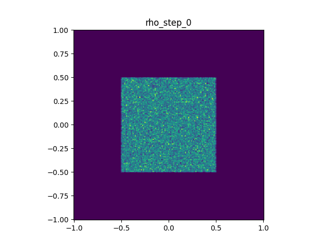

English | [中文](big_bang.md)

## Big Bang

This document walks through the development of a 2D electrostatic PIC (Particle-In-Cell) example.

The example places a small cluster of same-sign charged particles in a square domain `[-1, 1] x [-1, 1]`. The particles are initially concentrated near the origin, then repel each other under the self-consistent electric field and expand outward; particles reaching the boundary are absorbed. This example covers the main workflow of electrostatic PIC, but does not include collisions, magnetic fields, or complex geometric boundaries.



Modules, features, and typical usage covered:
- Particle definition and particle containers
- Particle-field interaction
- Poisson equation solving

### Preparation

Create a new file `big_bang.cpp` under `example/big_bang/`, then modify it step by step according to each stage. `example/big_bang/stage_1.cpp` through `stage_6.cpp` are reference answers at the end of each stage, for comparing with your own code; they are not programs you must run.

It is recommended to enter the example directory from the project root and load the build environment:

```bash
cd example/big_bang
source ../../env_load.sh
```

There may be leftover `.plt`, `.png`, or `.gif` files in `output/`. You can manually clear `output/` first.

### Stage 1: Create the Grid and Fields

In `big_bang.cpp`, first include the necessary headers and use `namespace psum::prelude`:
```cpp
#include <iostream>
#include <sycl/sycl.hpp>
#include <Eigen/Core>
#include <psum/psum.hpp>
using namespace std;
using namespace psum::prelude;
```
Add the particle type definition:

```cpp
using Particle = tagged_struct<
    tag_bind<property::position, Eigen::RowVector2d>,  // 2D position
    tag_bind<property::velocity, Eigen::RowVector2d>,  // 2D velocity
    tag_bind<property::charge, double>,                // charge
    tag_bind<property::mass, double>                 // particle mass
>;
```
Add the grid definition in the main function:
```cpp
int main() {
    grid2D grid({-1.0, -1.0}, {1.0, 1.0}, {256, 256});
    sycl::queue q{sycl::default_selector_v};

    // You can see the device info
    cout << "device: " << q.get_device().get_info<sycl::info::device::name>() << endl;
    
    // Node fields for storing electric potential and charge density (device-side, usable in kernels)
    node_field2D<double> phi(q, grid);      // electric potential
    node_field2D<double> rho(q, grid);      // charge density

    return 0;
}
```

Write the makefile:
```makefile
-include ../../config.mk

INCLUDES = -I ../../include -I ../../src

big_bang: big_bang.cpp
	$(ACPP) $(COMMON_FLAGS) $(INCLUDES) -o bb big_bang.cpp $(LIBS) $(LDFLAGS)
	./bb
```
(These commands already exist in `example/big_bang/makefile`, just uncomment them.)

For subsequent stages, compile and run the same way:

```bash
make big_bang
```

Before compiling, make sure you have sourced `env_load.sh` from the project root, then run `make big_bang`.
If you see `make: acpp: No such file or directory`, it usually means you haven't run `source ../../env_load.sh` yet, or the dependencies/installation were not successful.

After a successful run, you should see the device info printed, for example `AdaptiveCpp OpenMP host device` (if your machine has a GPU, it may show the GPU model instead).
On the first run, AdaptiveCpp may print kernel cache warnings; these are typically just JIT compilation notices, not program failures.

What you need to know at this stage:
- `Particle` defines what attributes a particle has.
- `grid2D` defines the 2D computational domain and grid resolution.
- `node_field2D` is a field defined on grid nodes, used here for electric potential `phi` and charge density `rho`.

The code state at the end of this stage can be found in `example/big_bang/stage_1.cpp`.

### Step 2: Add Particle Container and Initialize Particles and Charge Deposition

Continue modifying `big_bang.cpp` from Stage 1:
- Add `ParticleGroup` after the `Particle` definition.
- Add `make_particles` and `deposit_charge` before `main`.
- In `main`, create the particle container, initialize particles, deposit charge, then output `output/initial_rho.plt`.
- Modify the makefile to create `output/` first, then run the program and generate images.

After `Particle`, define `particle_group` as the particle container:

```cpp
using ParticleGroup = particle_group<Particle, pos_x_nan_is_invalid>;
```

The `pos_x_nan_is_invalid` here will be used later in the boundary absorption stage: when a particle is marked as invalid, `particle_group` iteration will automatically skip it.

The particle initialization function takes `ParticleGroup&` directly, generates a host-side `vector<Particle>` inside the function, and inserts all particles into the particle group at once:

```cpp
void make_particles(size_t count, ParticleGroup& particles) {
    rander R;
    vector<Particle> particle_vec(count);
    for (auto& p : particle_vec) {
        get<property::position>(p) = {R() - 0.5, R() - 0.5};
        auto rand_vec = RandFunction3D::RandV_Maxwell(R, 100000, 2.18e-25);
        get<property::velocity>(p) = {rand_vec.x(), rand_vec.y()};
        get<property::charge>(p) = 1.602e-19 * 1e7;
        get<property::mass>(p) = 2.18e-25 * 1e7;
    }
    particles.insert(particle_vec);
}
```

The position here is uniformly distributed over `[-0.5, 0.5] x [-0.5, 0.5]`.
Velocity is generated using the Maxwell distribution via `RandFunction3D::RandV_Maxwell` from PSuM's random utilities, then the `x/y` components are taken as 2D velocities.
Charge and mass are both multiplied by `1e7`, representing many real particles (macro-particles).

Next, add the charge deposition function:

```cpp
void deposit_charge(ParticleGroup& particles, node_field2D<double>& rho) {
    rho.setZero();
    double cell_area = rho.getGrid().del<0>() * rho.getGrid().del<1>();
    particles.for_each([&](sycl::handler& h) {
        auto rho_acc = rho.get_access(h);
        return [=](Particle& p) {
            add_back(
                get<property::position>(p),
                get<property::charge>(p) / cell_area,
                rho_acc
            );
        };
    });
}
```

Note that `cell_area` is obtained directly from `rho.getGrid()`, so `deposit_charge` doesn't need additional grid parameters.
`rho.setZero()` clears the previous deposition result, and `add_back` adds particle charge to grid nodes with interpolation weights.

In `main`, add:

```cpp
ParticleGroup particles(q);
make_particles(100000, particles);
deposit_charge(particles, rho);
rho.plot("output/initial_rho.plt", "rho", 0.0);
```

Adjust the makefile:

```makefile
big_bang: big_bang.cpp
	$(ACPP) $(COMMON_FLAGS) $(INCLUDES) -o bb big_bang.cpp $(LIBS) $(LDFLAGS)
	mkdir -p output # create output directory
	./bb
	python3 ../pltview.py output/initial_rho.plt # convert the generated plt file to png
```

After a successful run, you should see `output/initial_rho.plt` and the generated `output/initial_rho.png`.
If `.png` is not generated, first check whether `python3 ../pltview.py output/initial_rho.plt` was executed, and whether the current directory is `example/big_bang/`.

What you need to know at this stage:
- `ParticleGroup` is a container that holds many particles.
- `make_particles` first generates particles on the host side, then inserts them into the container all at once.
- `deposit_charge` distributes particle charge to grid nodes with interpolation weights.

The code state at the end of this stage can be found in `example/big_bang/stage_2.cpp`.

### Step 3: Add Particle Motion and Boundary Conditions

Continue modifying `big_bang.cpp` from Stage 2:
- Add `move_particles` after `deposit_charge`.
- Change the "deposit once and output" code in `main` to a time loop.
- Modify the makefile to combine `rho_step_*.plt` files into an animation.

At this stage, we don't add the Poisson solver yet, so `phi` is still a zero field; however, we still write the full PIC push logic that derives the electric field from `phi`.
This way, in the next stage we only need to make `phi` the potential computed by the solver, without changing the particle push function.

Add the particle motion function after `deposit_charge`:

```cpp
void move_particles(ParticleGroup& particles, node_field2D<double>& phi, double dt) {
    particles.for_each([&](sycl::handler& h) {
        auto phi_acc = phi.get_access(h);
        return [=](Particle& p) {
            auto& position = get<property::position>(p);
            auto& velocity = get<property::velocity>(p);

            auto grad_phi = interp_diff(position, phi_acc);
            Eigen::RowVector2d electric_field(-grad_phi[0], -grad_phi[1]);
            velocity += electric_field * get<property::charge>(p) / get<property::mass>(p) * dt;
            position += velocity * dt;

            if (!phi_acc.getGrid().inGrid(position)) {
                ParticleGroup::validator::make_invalid(p);
            }
        };
    });
}
```

Here `interp_diff(position, phi_acc)` returns the gradient of the potential, and the electric field is `-grad(phi)`. Currently `phi` is zero, so the electric field is zero.
Particles only fly with their initial Maxwell velocities.
For boundary handling, `ParticleGroup::validator::make_invalid(p)` is used; particles marked as invalid will be skipped in subsequent `particle_group` iterations.

Then replace the "deposit once" part from step 2 with a time loop:

```cpp
double dt = 2.0e-7;
int steps = 400;
int output_interval = 10;

for (int step = 0; step <= steps; ++step) {
    deposit_charge(particles, rho);
    if (step % output_interval == 0) {
        rho.plot("output/rho_step_" + to_string(step) + ".plt", "rho", step * dt);
        cout << "step = " << step << ", alive = " << particles.size() << endl;
    }
    move_particles(particles, phi, dt);
}
```

Adjust the makefile to create an animation with `pltview.py` after running the program:

```makefile
big_bang: big_bang.cpp
	$(ACPP) $(COMMON_FLAGS) $(INCLUDES) -o bb big_bang.cpp $(LIBS) $(LDFLAGS)
	mkdir -p output
	./bb
	python3 ../pltview.py rho_step output
```

`python3 ../pltview.py rho_step output` will search for `.plt` files starting with `rho_step_` in `output/` and combine them into an animation.
After a successful run, the terminal will print `step = ...`, `alive = ...`, and generate `output/rho_step.gif`.
Although `phi` is a zero field at this stage, particles will still fly with their initial Maxwell velocities, so a small number of particles will leave the boundary later.

What you need to know at this stage:
- `interp_diff(position, phi_acc)` computes the gradient from the potential field.
- The electric field is `-grad(phi)`; currently `phi` is zero, so there is no self-consistent electric field acceleration yet.
- Particles leaving the grid are marked as invalid and will be skipped in subsequent iterations.

The code state at the end of this stage can be found in `example/big_bang/stage_3.cpp`.

### Step 4: Add the Poisson Solver

Continue modifying `big_bang.cpp` from Stage 3:
- Add boundary condition utilities in the namespace section.
- After creating particles, create `Poisson_solver_2d` and set four Dirichlet boundaries.
- Add host-side temporary fields `phi_host` and `rho_host`.
- After each charge deposition, solve for `phi`, and temporarily keep `if (step == 0) break;` to only check the initial potential.
- The makefile compilation command adds `$(USE_BACKENDS)` from this stage onward.

At this stage, we replace the `phi` that has been zero in step 3 with the potential solved from charge density `rho`.
To first verify the Poisson solver and potential output separately, this step exits the program after completing the `rho -> phi` solve and output at step 0.

First, add boundary condition utilities in the namespace section:

```cpp
using namespace psum::field_solver::boundary_creator;
```

After creating particles, create the Poisson solver and set all four edges as fixed-value boundaries:

```cpp
Poisson_solver_2d psolver;
psolver.init(
    grid,
    Poisson_solver_2d::Cartesian,
    {
        Dirichlet_line(grid, boundary_direction_2d::N) = 0,
        Dirichlet_line(grid, boundary_direction_2d::S) = 0,
        Dirichlet_line(grid, boundary_direction_2d::E) = 0,
        Dirichlet_line(grid, boundary_direction_2d::W) = 0
    }
);
```

The current native backend works on the host side, so you also need to prepare host-side temporary fields:

```cpp
host_node_field2D<double> phi_host(grid);
host_node_field2D<double> rho_host(grid);
```

Then in the main loop, solve for the potential after each charge deposition:

```cpp
for (int step = 0; step <= steps; ++step) {
    deposit_charge(particles, rho);
    rho_host.copy(rho.getContent().to_host());
    psolver.solve(phi_host.data(), rho_host.data());
    phi.copy(phi_host.getContent());

    if (step % output_interval == 0) {
        rho.plot("output/rho_step_" + to_string(step) + ".plt", "rho", step * dt);
        phi.plot("output/phi_step_" + to_string(step) + ".plt", "phi", step * dt);
        cout << "step = " << step << ", alive = " << particles.size() << endl;
    }
    if (step == 0) break; // temporary logic, only output initial distribution
    move_particles(particles, phi, dt);
}
```

Here `rho_host.copy(rho.getContent().to_host())` copies device-side `rho` to host;
`psolver.solve(phi_host.data(), rho_host.data())` solves the Poisson equation;
`phi.copy(phi_host.getContent())` copies the host-side potential back to device-side `phi`.

Whether you need host-side copies depends on whether the solver backend supports device-side pointers.
For GPU backends like `cuda_sparselu_gpu`, this step is not needed (and would cause errors).

Adjust the makefile to view the initial potential after running the program:

```makefile
big_bang: big_bang.cpp
	$(ACPP) $(COMMON_FLAGS) $(INCLUDES) -o bb big_bang.cpp $(USE_BACKENDS) $(LIBS) $(LDFLAGS)
	mkdir -p output
	./bb
	python3 ../pltview.py phi_step output
```

Here `$(USE_BACKENDS)` is added to facilitate using non-native backends later.
If linking reports missing `registry.o`, `impls.o`, or other field solver backend files, it means the solver backend has not been built yet.
You need to build these backend object files first according to the build documentation.

After running, you should get `output/phi_step.png`. This stage only outputs step 0, so `pltview.py` generates a single image instead of an animation. The potential distribution should be smoother than the charge distribution and reach 0 at all four boundaries.
This tutorial uses the native backend by default, so the two host/device copies `rho_host.copy(...)` and `phi.copy(...)` are needed.
If you switch to a GPU backend later, this code can be removed.

What you need to know at this stage:
- The Poisson solver converts charge density `rho` to electric potential `phi`.
- `$(USE_BACKENDS)` links the solver backend into the program.
- Here we exit at step 0 first, to separately confirm that the potential solve and output are correct.

The code state at the end of this stage can be found in `example/big_bang/stage_4.cpp`.

### Step 5: Use the Solver-Computed Electric Field to Update Particle Positions

Continue modifying `big_bang.cpp` from Stage 4:
- Delete `if (step == 0) break;` in the main loop.
- In the makefile, generate animations for both `rho_step` and `phi_step`.

Step 4 can already compute the potential from the current particle distribution, but the program exits at step 0. There is very little to do at this stage: just remove

```cpp
if (step == 0) break;
```

from the main loop.

Adjust the makefile to generate both charge density and potential animations after running:

```makefile
big_bang: big_bang.cpp
	$(ACPP) $(COMMON_FLAGS) $(INCLUDES) -o bb big_bang.cpp $(USE_BACKENDS) $(LIBS) $(LDFLAGS)
	mkdir -p output
	./bb
	python3 ../pltview.py rho_step output
	python3 ../pltview.py phi_step output
```

After running, you should see the particle cluster expand rapidly; particles reaching the boundary are marked as invalid by `ParticleGroup::validator::make_invalid(p)`, so the `alive` count will decrease.

What you need to know at this stage:
- Each step first deposits `rho`, then solves `phi`, and finally pushes particles using `phi`.
- `output/rho_step.gif` shows how the charge density (corresponding to particle spatial distribution) expands.

The code state at the end of this stage can be found in `example/big_bang/stage_5.cpp`.

### Step 6: Observe Energy Conservation

Continue modifying `big_bang.cpp` from Stage 5:
- Add `<fstream>`.
- Add `kinetic_energy` and `field_energy` after `move_particles`.
- In `main`, open `output/energy.plt`; create a reusable shared variable.
- After solving for `phi`, tally the total energy and write it to the file.
- Add `python3 ../pltview.py energy output` to the makefile.

Step 5 has completed the self-consistent particle push: each step first deposits `rho` from particles, then solves `phi`, and finally pushes particles with the electric field.
Now we can add an energy diagnostic to observe whether the numerical process is roughly conservative before a large number of particles leave the boundary.

First add `<fstream>` needed for file output:

```cpp
#include <fstream>
```

Particle kinetic energy can be directly accumulated in parallel on the particle container.
Since all particles simultaneously write to the same scalar, this scalar needs to be placed in device-accessible shared memory, with `atomic_add` for reduction:

```cpp
double kinetic_energy(ParticleGroup& particles, double* energy) {
    *energy = 0.0;
    particles.for_each([&](sycl::handler& h) {
        return [=](Particle& p) {
            const auto& velocity = get<property::velocity>(p);
            atomic_add(*energy, 0.5 * get<property::mass>(p) * velocity.squaredNorm());
        };
    });
    return *energy;
}
```

Field energy is the integral (accumulation) of the product of charge density and potential, which can be implemented using the `for_each` function provided by the field:

```cpp
double field_energy(node_field2D<double>& phi, node_field2D<double>& rho, double* energy) {
    *energy = 0.0;
    double cell_area = phi.getGrid().del<0>() * phi.getGrid().del<1>();
    phi.for_each([&](sycl::handler& h) {
        auto rho_acc = rho.get_access(h);
        return [=](size_t i, double& phi_value) {
            atomic_add(*energy, 0.5 * phi_value * rho_acc(i) * cell_area);
        };
    });
    return *energy;
}
```

Here `phi.for_each`'s first parameter `i` gives the current grid point index, and `rho_acc(i)` accesses the charge density at the same location.

In `main`, open the energy file and create a reusable shared variable:

```cpp
ofstream energy_file("output/energy.plt");
energy_file << "variables=time,relative_energy" << endl;
double initial_energy = 0.0;
double* energy = shared_variable<double>(q);
```

`energy` is created only once in the main function, then passed to both the kinetic and field energy functions for reuse. Each function resets `*energy` to zero at the start.

In the main loop, after solving for `phi`, immediately tally the total energy and its relative value:

```cpp
double kinetic = kinetic_energy(particles, energy);
double electric = field_energy(phi, rho, energy);
double total = kinetic + electric;
if (step == 0) {
    initial_energy = total;
}
energy_file << step * dt << "\t" << (total / initial_energy) << endl;
```

The output file `output/energy.plt` has only two columns: time and `relative_energy`. This allows direct reuse of `pltview.py`'s 1D curve plotting logic.

Finally, adjust the makefile so that the `big_bang` target generates charge density, potential, and energy error plots:

```makefile
big_bang: big_bang.cpp
	$(ACPP) $(COMMON_FLAGS) $(INCLUDES) -o bb big_bang.cpp $(USE_BACKENDS) $(LIBS) $(LDFLAGS)
	mkdir -p output
	./bb
	python3 ../pltview.py rho_step output
	python3 ../pltview.py phi_step output
	python3 ../pltview.py energy output
```

After running, you will get `output/energy.png`. Before a large number of particles are absorbed by the boundary, `relative_energy` should be close to 1;
after that, since particles continuously leave the computational domain, the total energy will drop significantly.

What you need to know at this stage:
- Kinetic energy comes from particle velocities, field energy comes from `rho` and `phi`.
- `atomic_add` is used to safely accumulate contributions from many particles into a single number.
- `output/energy.png` is not expected to stay near 0 throughout; after particles leave the boundary, total energy drops rapidly.

The code state at the end of this stage can be found in `example/big_bang/stage_6.cpp`.

### Output and Common Errors

`pltview.py` has two common usage patterns:

```bash
python3 ../pltview.py output/initial_rho.plt
python3 ../pltview.py rho_step output
```

The first is for a single `.plt` file, usually generating a corresponding `.png`.
The second is for a set of files; it searches for `.plt` files starting with `rho_step_` in `output/` and combines them into an animation; `phi_step output` and `energy output` work similarly.

Common errors can be troubleshooted as follows:

- `make: acpp: No such file or directory`: Usually means `source ../../env_load.sh` has not been executed.
- `No rule to make target 'big_bang'`: The current directory is wrong, or the `big_bang` target hasn't been added to the makefile yet.
- `No rule to make target 'big_bang.cpp'`: The `big_bang` target exists, but `big_bang.cpp` hasn't been created in the current directory yet.
- No `output/...` files generated: Confirm the makefile has `mkdir -p output`, and the program is running under `example/big_bang/`.
- `pltview.py` doesn't print `wrote ...`: The plotting script didn't complete successfully; check the Python error messages above in the terminal.
- Linking reports missing backend `.o` files: Build the field solver backend first, or check that the backends enabled in `config.mk.local` match your local environment.
- Seeing `AdaptiveCpp Warning`: Usually runtime JIT compilation notices, not necessarily program errors; as long as the program continues to output and generate files, it's fine.
