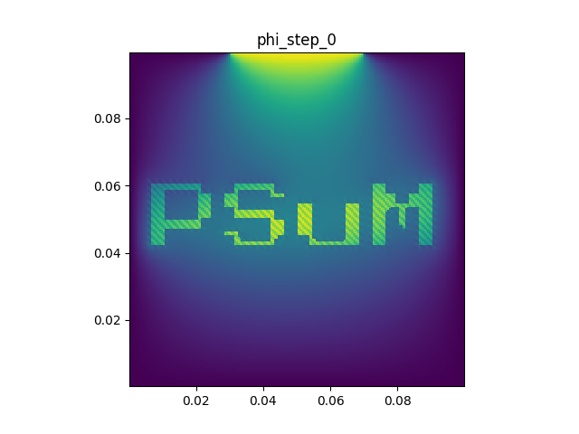

English | [中文](neon_light.md)

## Neon Light

This document demonstrates a complex boundary example using a 2D Poisson solver.

The example reads a pattern from a structured `.plt` bitmap file and sets the regions with value 1 as internal Dirichlet boundary regions.
This fixed-value region is not a constant, but a function that changes rapidly in space and time; the final output will look like a flickering neon sign.



Modules, features, and typical usage covered:
- Reading external `.plt` files
- Setting complex boundaries for the 2D Poisson equation

### Preparation

Create `neon_light.cpp` under `example/neon_light/`, then modify this file step by step following each stage.
`example/neon_light/stage_1.cpp` through `stage_5.cpp` are reference answers at the end of each stage, for comparison with your own code; they are not programs you need to run.

The input bitmap file is located at:

```text
docs/psum_tour/psum_bitmap.plt
```

It is a 100 x 100 node field with variable name `n`, containing a binary pattern.

It is recommended to enter the example directory from the project root and load the build environment:

```bash
cd example/neon_light
source ../../env_load.sh
```

There may be leftover `.plt`, `.png`, or `.gif` files in `output/`.
You can manually clear `output/` first.

### Stage 1: Read the Bitmap and Restore the Node Field

In `neon_light.cpp`, first include the necessary headers and use the PSuM prelude:

```cpp
#include <cmath>
#include <fstream>
#include <iostream>
#include <sstream>
#include <string>
#include <vector>

#include <psum/psum.hpp>

using namespace std;
using namespace psum::prelude;
```

Next, implement a small function to restore a PSuM `.plot` output point-type `.plt` file into a `host_node_field2D<double>`:

```cpp
host_node_field2D<double> read_node_field_plt(const string& filename) {
    ifstream in(filename);

    string line;
    string zone;
    getline(in, line);
    getline(in, zone);

    vector<double> values;
    double xmin = 1e300;
    double xmax = -1e300;
    double ymin = 1e300;
    double ymax = -1e300;
    double x = 0.0;
    double y = 0.0;
    double v = 0.0;
    while (getline(in, line)) {
        istringstream row(line);
        if (!(row >> x >> y >> v)) {
            continue;
        }
        xmin = fmin(xmin, x);
        xmax = fmax(xmax, x);
        ymin = fmin(ymin, y);
        ymax = fmax(ymax, y);
        values.push_back(v);
    }

    int ni = stoi(zone.substr(zone.find('=', zone.find('i')) + 1));
    int nj = stoi(zone.substr(zone.find('=', zone.find('j')) + 1));

    grid2D grid({xmin, ymin}, {xmax, ymax}, {nj - 1, ni - 1});
    return host_node_field2D<double>(std::move(values), grid);
}
```

Note here:
- In a 2D `.plt` file, `zone i` corresponds to the number of nodes in the second coordinate direction, and `zone j` corresponds to the number of nodes in the first coordinate direction, so when restoring the `grid2D`, we use `{nj - 1, ni - 1}`.

In `main`, read the bitmap and output it immediately to verify the reading direction and pattern are correct:

```cpp
int main() {
    const string bitmap_file = "../../docs/psum_tour/psum_bitmap.plt";
    auto mask = read_node_field_plt(bitmap_file);
    mask.plot("output/mask.plt", "mask", 0.0);
    return 0;
}
```

In the makefile, create `output/` for this stage, run `neon_light.cpp`, and convert `.plt` to an image:

```makefile
-include ../../config.mk

INCLUDES = -I ../../include -I ../../src

neon_light: neon_light.cpp
	$(ACPP) $(COMMON_FLAGS) $(INCLUDES) -o neon_light neon_light.cpp $(LIBS) $(LDFLAGS)
	mkdir -p output
	./neon_light
	python3 ../pltview.py output/mask.plt

clean:
	rm -f neon_light
	rm -rf output
```

(These commands already exist in `example/neon_light/makefile`; just uncomment them.)

Compile and run the same way for each subsequent stage:

```bash
make neon_light
```

After a successful run, you should see `output/mask.plt` (open with Tecplot) and `output/mask.png` (viewable directly).

What you need to know at this stage:

- `host_node_field2D<double>` is a host-side node-centered 2D field.
- The `x y n` data in a `.plt` file can be restored into the field's content.
- `mask.plot(...)` is used to quickly verify the read result.

The code state at the end of this stage can be found in `example/neon_light/stage_1.cpp`.

### Stage 2: Create the Poisson Grid and Solve Once

Continue modifying `neon_light.cpp` from Stage 1:

- Add `using namespace psum::field_solver::boundary_creator;`.
- Inherit the physical range from `mask.getGrid()` and create a 200 x 200 Poisson grid.
- Configure Dirichlet boundaries with zero on all four sides.
- Temporarily use the mask region as a source, solve once, and output the result.

The Poisson grid can have a different resolution than the input bitmap grid. Here we use a finer 200 x 200 grid, but the physical range is inherited from the bitmap:

```cpp
const auto& mask_grid = mask.getGrid();
grid2D grid(
    {mask_grid.lowerBound<0>(), mask_grid.lowerBound<1>()},
    {mask_grid.upperBound<0>(), mask_grid.upperBound<1>()},
    {200, 200}
);
```

Create and initialize the solver. For now, set all four edges to zero fixed-value boundaries:

```cpp
Poisson_solver_2d solver;
solver.init(
    grid,
    Poisson_solver_2d::Cartesian,
    {
        Dirichlet_line(grid, boundary_direction_2d::N) = 0.0,
        Dirichlet_line(grid, boundary_direction_2d::S) = 0.0,
        Dirichlet_line(grid, boundary_direction_2d::E) = 0.0,
        Dirichlet_line(grid, boundary_direction_2d::W) = 0.0
    }
);
```

To verify that the solver and output pipeline work, you can set the pattern region as a source:

```cpp
host_node_field2D<double> phi(grid);
host_node_field2D<double> source(grid);
source.for_each([&](size_t, double& rho, const auto& pos) {
    rho = interp(host_node_field2D<double>::Position{pos[0], pos[1]}, mask) > 0.5 ? 10.0 : 0.0;
});

solver.solve(phi.data(), source.data());
phi.plot("output/phi.plt", "phi", 0.0);
```

From this stage onward, you need to link the Poisson solver backend, so change the compilation line in the makefile to:

```makefile
	$(ACPP) $(COMMON_FLAGS) $(INCLUDES) -o neon_light neon_light.cpp $(USE_BACKENDS) $(LIBS) $(LDFLAGS)
```

If you get compilation errors about not finding Poisson-related implementations, first confirm that `$(USE_BACKENDS)` has been added to the makefile.

Run:

```bash
make neon_light
```

After a successful run, you should see `output/phi.plt` and `output/phi.png`.
Compared to the mask output, the phi output looks much softer, and the pattern outline may even be hard to see. This is due to the nature of the Poisson equation.

What you need to know at this stage:

- The Poisson grid's physical range can come from an existing field.
- `interp(..., mask)` can interpolate values between grids of different resolutions.
- `solver.solve(phi.data(), source.data())` writes the solution result into `phi`.

The code state at the end of this stage can be found in `example/neon_light/stage_2.cpp`.

### Stage 3: Turn the Pattern into an Internal Dirichlet Boundary

Continue modifying `neon_light.cpp` from Stage 2:

- No longer use the pattern as a source.
- Use `Dirichlet_func` to set the pattern region as an internal Dirichlet boundary.

The internal boundary selector function is written directly inside `solver.init(...)`, after the existing west boundary condition:

```cpp
        Dirichlet_line(grid, boundary_direction_2d::W) = 0.0,   // <-- added a comma
        Dirichlet_func(grid, [&](double x, double y) {
            return interp(host_node_field2D<double>::Position{x, y}, mask) > 0.01;
        }) = 1.5
```

Here we don't write a custom interpolation utility function, but instead use the `interp` already available in the PSuM field module.
Linear interpolation produces intermediate values between 0 and 1 at the edges of the 0-1 region, so we use `0.01` as the threshold.

At this stage, set the source to zero and only observe the potential generated by the boundary conditions:

```cpp
host_node_field2D<double> phi(grid);
host_node_field2D<double> source(grid);
source.setZero();

solver.solve(phi.data(), source.data());
phi.plot("output/phi.plt", "phi", 0.0);
```

Run:

```bash
make neon_light
```

After a successful run, you should see `output/phi.plt` and `output/phi.png` have changed.
Compared to the previous stage's output, the entire pattern region appears to be "glowing."

What you need to know at this stage:

- `Dirichlet_func` can use any boolean function to select internal fixed-value regions.
- The mask and Poisson grid don't need to match; the hit detection is handled by `interp`.
- Multiple boundary conditions can be placed in the same `solver.init(...)` list.

The code state at the end of this stage can be found in `example/neon_light/stage_3.cpp`.

### Stage 4: Make the Internal Boundary Value Change Over Time

Continue modifying `neon_light.cpp` from Stage 3:

- Change the internal Dirichlet value from a constant to a lambda.
- Add a time variable `t`.
- Add a loop to repeatedly solve and output `phi_step_*.plt`.
- In the makefile, combine `phi_step_*.plt` into an animation.

Before defining the solver, define a potential function that changes rapidly with time and space:

```cpp
double t = 0.0;
auto voltage = [&](double time, double x, double y) {
    double high_freq = sin(3000.0 * (x + y) + 100.0 * time) + 1;
    double low_freq = cos(30.0 * (x - y) - 10.0 * time) + 1;
    return (high_freq * 0.2 + low_freq) * cos(60 * y - 3);
};
```

Then change the internal boundary assignment to a lambda:

```cpp
Dirichlet_func(grid, [&](double x, double y) {
    return interp(host_node_field2D<double>::Position{x, y}, mask) > 0.01;
}) = [&](const auto& pos) {
    return voltage(t, pos[0], pos[1]);
},
```

`solver.init(...)` only needs to be called once.
In the subsequent loop, update `t`, then call `solver.solve(...)`:

```cpp
int steps = 80;
double dt = 0.02;
for (int step = 0; step <= steps; ++step) {
    t = step * dt;
    source.setZero();
    solver.solve(phi.data(), source.data());
    phi.plot("output/phi_step_" + to_string(step) + ".plt", "phi", t);
    cout << "step = " << step << ", t = " << t << endl;
}
```

Run:

```bash
make neon_light
```

Also adjust the plotting commands in the makefile to:

```makefile
	python3 ../pltview.py output/mask.plt
	python3 ../pltview.py phi_step output
```

After a successful run, you should see `step = ...` printed in the terminal, and `output/phi_step.gif` generated.

What you need to know at this stage:

- The boundary value lambda captures the variable `t`, so each solve step gets a different fixed-value boundary.
- The dynamic effect in the animation comes from the time-varying Dirichlet boundary.

The code state at the end of this stage can be found in `example/neon_light/stage_4.cpp`.

### Stage 5: Add Edge Weak Potential and Complete the Neon Light Effect

Continue modifying `neon_light.cpp` from Stage 4:

- Overlay partially selected Dirichlet boundaries.
- Use the intermediate values from linear interpolation to add a weaker edge Dirichlet boundary.

Even after boundary conditions have been set, later-set ones can override earlier ones. Add the following after the original north boundary:
```cpp
        Dirichlet_line(grid, boundary_direction_2d::N) = 0.0,
        Dirichlet_line(grid, boundary_direction_2d::N,
            {grid.lowerBound<0>() + 0.3 * grid.span<0>(),
             grid.upperBound<0>() - 0.3 * grid.span<0>()}) = 2.5, // Set a higher fixed value on a short segment of the north boundary
```

Function-type boundary conditions can also be overlaid. Linear interpolation `interp(..., mask)` produces values between `0` and `1` at the edges of the mask. Select this region and place it after the original settings:

```cpp
Dirichlet_func(grid, [&](double x, double y) {
    return interp(host_node_field2D<double>::Position{x, y}, mask) > 0.01;  // <-- original boundary condition
}) = [&](const auto& pos) {
    return voltage(t, pos[0], pos[1]);
},                                                                          // <-- added a comma
Dirichlet_func(grid, [&](double x, double y) {
    double mask_val = interp(host_node_field2D<double>::Position{x, y}, mask);
    return mask_val > 0.01 && mask_val < 0.99;                          // <-- select the edge of the mask
}) = [&](const auto& pos) {
    return voltage(t, pos[0], pos[1]) * 0.5;                            // <-- use a different fixed value
}
```

Run:

```bash
make neon_light
```

After a successful run, the final output includes:

```text
output/mask.png
output/phi_step.gif
```

You should be able to see a fairly clear pattern outline and a flickering effect.

What you need to know at this stage:

- Boundary conditions can be overlaid; later-set conditions override earlier ones.
- The key API path for this entire example is `read_node_field_plt`, `interp`, `Dirichlet_func`, and `Poisson_solver_2d`.

The code state at the end of this stage can be found in `example/neon_light/stage_5.cpp`.

### Output and Common Errors

`pltview.py` has two common usage patterns:

```bash
python3 ../pltview.py output/initial_rho.plt
python3 ../pltview.py rho_step output
```

The first is for a single `.plt` file, typically generating a corresponding `.png`.
The second is for a set of files; it searches `output/` for `.plt` files starting with `rho_step_` and combines them into an animation; `phi_step output` and `energy output` work similarly.

Common errors can be investigated as follows:

- `make: acpp: No such file or directory`: Usually means you haven't run `source ../../env_load.sh`.
- `No rule to make target 'neon_light'`: You're in the wrong directory, or the `neon_light` target hasn't been added to the makefile yet.
- `No rule to make target 'neon_light.cpp'`: The `neon_light` target exists, but you haven't created `neon_light.cpp` in the current directory yet.
- No `output/...` files generated: Confirm the makefile has `mkdir -p output`, and that the program is running under `example/neon_light/`.
- `pltview.py` doesn't print `wrote ...`: The plotting script didn't complete successfully; check the Python error output above in the terminal.
- Linker error about missing backend `.o` files: Build the field solver backend first, or check whether the backends enabled in `config.mk.local` match your local environment.
- Seeing `AdaptiveCpp Warning`: These are usually runtime JIT compilation hints and not necessarily program errors; as long as the program continues to output and generate files, everything is fine.
