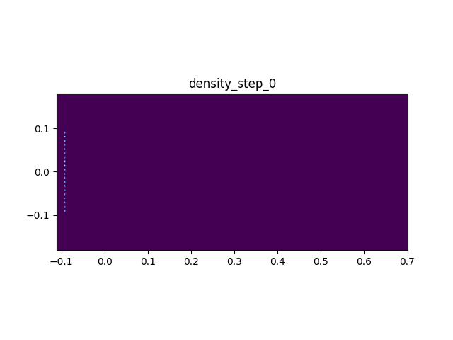

[English](telescope_en.md) | 中文

## Telescope

本文档将展示一个二维几何光线追踪算例。

算例模拟一个简化版的 Maksutov 望远镜：平行光从左侧入射，经过校正器折射、主镜反射、次镜反射后会聚到焦平面。
几何参数基本来自 COMSOL 的 Gregory–Maksutov Telescope 案例。



使用到的模块, 特性或典型用法:
- 粒子定义和粒子容器
- 粒子边界的设置

### 准备工作

在 `example/telescope/` 下新建 `telescope.cpp`，然后按照每个 stage 逐步修改这个文件。
`example/telescope/stage_1.cpp` 到 `stage_5.cpp` 是每个阶段结束时的参考答案，用来和自己的代码对照；不必当作必须运行的程序。

推荐从项目根目录进入算例目录，并加载编译环境：

```bash
cd example/telescope
source ../../env_load.sh
```

这里的`output/` 里可能残留旧的 `.plt`、`.png` 或 `.gif` 文件。
可以先手动清空 `output/`。

> **首次运行速度**：AdaptiveCpp 使用 JIT 机制在首次运行时编译内核导致耗时增加。本例粒子数较少，JIT 开销占比大，编译后的首次运行不反映真实性能。

### Stage 1：创建光子和基本运动循环

在 `telescope.cpp` 中，首先 include 必要的头文件并 using namespace：

```cpp
#include <cmath>
#include <iostream>
#include <vector>
#include <sycl/sycl.hpp>
#include <Eigen/Core>
#include <psum/psum.hpp>

using namespace std;
using namespace psum::prelude;
using namespace Eigen;
```

添加光子类型定义：

```cpp
using Photon = tagged_struct<
    tag_bind<property::position, Eigen::RowVector2d>,
    tag_bind<property::velocity, Eigen::RowVector2d>
>;

using PhotonGroup = particle_group<Photon, pos_x_nan_is_invalid>;
```

光子需要位置和速度（方向）; `pos_x_nan_is_invalid` 表示当粒子被标记为无效后，`particle_group` 的遍历会自动跳过它。

添加主函数:

```cpp
int main() {
    sycl::queue q{sycl::default_selector_v};
    cout << "device: " << q.get_device().get_info<sycl::info::device::name>() << endl;
    grid2D grid({-0.11, -0.18}, {0.7, 0.18}, {540, 240});
    node_field2D<double> density(q, grid);
    PhotonGroup photons(q);
    return 0;
}
```

添加光子发射函数：

```cpp
vector<Photon> make_photons(int count, int num_way, double ds, double width, random::rander& R) {
    vector<Photon> photons(count);
    for (int i = 0; i < count; ++i) {
        double y = -0.095 + 0.190 * (int(R()*num_way) + 0.5) / num_way;
        y += width * (R() - 0.5);
        RowVector2d dir(1.0, 0.0);

        get<property::velocity>(photons[i]) = dir;
        get<property::position>(photons[i]) = RowVector2d(-0.095, y) + dir * (ds * R());
    }
    return photons;
}
```

这里 `num_way` 控制光线数量，`width` 控制每束光线的随机偏移，`ds` 控制发射位置的随机扰动。

在 main 函数中创建运行简单的运动循环和绘图输出：

```cpp
    // ...
    double ds = 0.002;
    int steps = 500, pps = 1000, interval = 30;
    random::rander R;
    for (int step = 0; step < steps; ++step) {
        photons.insert(make_photons(pps, 20, ds, grid.span<1>() * 0.01, R));
        photons.for_each([&](sycl::handler& h) {
            return [=](Photon &p) {
                get<property::position>(p) += get<property::velocity>(p) * ds;
            };
        });
        if (step % interval == 0) {
            density.setZero();
            photons.for_each([&](sycl::handler& h) {
                auto da = density.get_access(h);
                return [=](Photon& p) {
                    if (da.getGrid().inGrid(get<property::position>(p)))
                        add_back(get<property::position>(p), 1.0, da);
                    else PhotonGroup::validator::make_invalid(p);
                };
            });
            density.plot("output/density_step_" + to_string(step) + ".plt", "density", step);
            cout << "step = " << step << ", alive = " << photons.size() << endl;
        }
    }
    cout << "Ray tracing 2D: wrote photon density snapshots." << endl;
```

其中`ds`是光程步长，起到类似时间步长的作用。每过`interval`步将输出一张二维统计图, 便于观察运动轨迹。

编写 makefile 文件：

```makefile
-include ../../config.mk

INCLUDES = -I ../../include -I ../../src

telescope: telescope.cpp
	$(ACPP) $(COMMON_FLAGS) $(INCLUDES) -o telescope telescope.cpp $(LIBS) $(LDFLAGS)
	mkdir -p output
	./telescope
	python3 ../pltview.py density_step output
```

(这些命令已经存在于 example/telescope/makefile 中, 只需要取消注释即可)

后续每个阶段都这样编译和运行：

```bash
make telescope
```

运行成功后，应该能看到 `output/density_step.gif`，显示光子从左向右传播，到达边界后消失。

这一阶段你只需要知道：
- `Photon` 定义光子有哪些属性。
- `make_photons` 在 host 端生成光子，再插入粒子容器。
- `for_each` 遍历所有光子并更新位置。
- 离开网格的光子会被 `make_invalid` 标记为无效。

这一阶段结束时的代码状态可以参考 `example/telescope/stage_1.cpp`。

### Stage 2：添加边界系统

从 Stage 1 的 `telescope.cpp` 继续修改：
- 添加 `OpticalMaterialSet` 类。
- 添加 `boundary_router`。
- 在 `main` 中创建 router 并在运动循环中调用。

首先定义光学材料集类：

```cpp
class OpticalMaterialSet {
public:
    enum class material_type { absorb };

    class acc_type {
    public:
        void action(material_type mat, Photon& p, double hit_x, double hit_y, double, double nx, double ny, double) const {
            if (mat == material_type::absorb) {
                PhotonGroup::validator::make_invalid(p);
            }
        }
    };

    acc_type get_access(sycl::handler&) const { return acc_type(); }
};

using Router = boundary_router<OpticalMaterialSet, Photon>;
using material_type = OpticalMaterialSet::material_type;
```

`OpticalMaterialSet` 定义了光学材料的行为。目前只有 `absorb` 类型，即吸收光子。
`acc_type` 是在 device 端使用的访问类型，`action` 函数处理光子与边界的交互。

在 main 中创建 router，设置矩形边界（使用网格边界）：

```cpp
Router router(q);
auto plane_1 = mesh_generator::extrude_xy_line_to_width({{0.0, 0.0}, {0.2, 0.2}}, 0.2);
router.set({{plane_1, material_type::absorb}}, 160, 80, 20);
```

虽然是二维计算域, boundary 模块中的几何输入必须是三维的. 因此使用 `mesh_generator::extrude_xy_line_to_width` 将二维线段扩展为三维表面.
这一阶段我们就只加入一个线段: 从(0, 0) 到 (0.2, 0.2) 的线段，打到线段的都会消失。
修改运动循环，在移动后调用 router 处理边界：

```cpp
photons.for_each([&](sycl::handler& h) {
    auto router_acc = router.get_access(h);
    return [=](Photon &p) {
        RowVector2d old_p = get<property::position>(p);
        get<property::position>(p) += get<property::velocity>(p) * ds;
        RowVector2d new_p = get<property::position>(p);
        router_acc.deal(old_p.x(), old_p.y(), 0.0, new_p.x(), new_p.y(), 0.0, p);
    };
});
```

`router_acc.deal` 接收旧位置和新位置，检查是否穿越边界和调用对应的材料行为。

运行成功后，应看到 `output/density_step.gif`，光子到达定义的线段后被吸收。

这一阶段你只需要知道：
- `OpticalMaterialSet` 定义材料的行为（目前只有吸收）。
- `boundary_router` 管理边界和材料的映射。
- `router_acc.deal` 处理光子与边界的交互。

这一阶段结束时的代码状态可以参考 `example/telescope/stage_2.cpp`。

### Stage 3：添加弧形边界

从 Stage 2 的 `telescope.cpp` 继续修改：
- 添加 `arc_surface` 函数。
- 使用 `mesh_generator::extrude_xy_line_to_width` 创建弧形表面。
- 设置弧形吸收边界。

添加弧形表面生成函数：

```cpp
vector<pair<double, double>> arc_surface(RowVector2d top, RowVector2d curv_vector, double half_angle, bool norm_out = true) {
    vector<pair<double, double>> pts;
    int seg = 80;
    RowVector2d center = top - curv_vector;
    double radius = curv_vector.norm();
    double base_angle = atan2(curv_vector.y(), curv_vector.x());
    for (int i = 0; i <= seg; ++i) {
        double t = -1.0 + 2.0 * i / seg;
        if (norm_out == false) t = -1.0 + 2.0 * (seg - i) / seg;
        double angle = base_angle + t * half_angle;
        pts.push_back({center.x() + radius * cos(angle), center.y() + radius * sin(angle)});
    }
    return pts;
}
```

这是一个简单的几何计算函数, 用于生成以`top`为弧顶, 以`top - curv_vector`为圆心的一段圆弧. `norm_out`用来控制法线的方向.
删除原本的 plane_1, 在 main 中创建一个简单的弧形吸收边界：

```cpp
auto barrier = mesh_generator::extrude_xy_line_to_width(
    arc_surface({0.3, 0.0}, {0.3, 0.0}, 0.3), 0.2);
router.set({{barrier, material_type::absorb}}, 160, 80, 20);
```

这里创建了一个弧形屏障。

运行成功后，应看到 `output/density_step.gif`，光子被弧形屏障阻挡。

这一阶段你只需要知道：
- `arc_surface` 生成弧形表面的点序列。
- `mesh_generator::extrude_xy_line_to_width` 将线段扩展为有宽度的网格。

这一阶段结束时的代码状态可以参考 `example/telescope/stage_3.cpp`。

### Stage 4：添加反射

从 Stage 3 的 `telescope.cpp` 继续修改：
- 在 `OpticalMaterialSet` 中添加 `specular` 类型。
- 实现镜面反射逻辑。
- 设置次镜和主镜。

在 `material_type` 枚举中添加 `specular`：

```cpp
enum class material_type { absorb, specular };
```

在 `action` 函数中添加镜面反射逻辑：

```cpp
void action(material_type mat, Photon& p, double hit_x, double hit_y, double, double nx, double ny, double) const {
    RowVector2d hit(hit_x, hit_y);
    RowVector2d n(nx, ny);
    n.normalize();

    RowVector2d dir = get<property::velocity>(p).normalized();
    double speed = get<property::velocity>(p).norm();
    if (mat == material_type::absorb) {
        PhotonGroup::validator::make_invalid(p);
    } else if (mat == material_type::specular) {
        n = dir.dot(n) > 0.0 ? -n : n;
        RowVector2d out = dir - 2.0 * dir.dot(n) * n;
        out.normalize();
        get<property::velocity>(p) = out * speed;
        get<property::position>(p) = hit + n * 1e-6;
    }
}
```

镜面反射公式：`out = dir - 2 * (dir · n) * n`，即入射方向减去法向分量的两倍。这个公式在二维和三维都能使用。
删掉原本的 barrier, 创建次镜和主镜的弧形表面：

```cpp
auto secondary = mesh_generator::extrude_xy_line_to_width(
    arc_surface({0.0301, 0.0}, {0.2861193, 0.0}, 0.08), 0.2);
auto primary_up = mesh_generator::extrude_xy_line_to_width(
    arc_surface({0.4808846, 0.0693117}, {1.1094470, 0.0693117}, 0.035), 0.2);
auto primary_down = mesh_generator::extrude_xy_line_to_width(
    arc_surface({0.4808846, -0.0693117}, {1.1094470, -0.0693117}, 0.035), 0.2);

router.set({{secondary, material_type::specular},
            {primary_up, material_type::specular},
            {primary_down, material_type::specular}}, 160, 80, 20);
```

此外，由于光路变长，迭代步数从原本的 `steps = 500` 增加到 1200。

这里使用了 primary_up 和 primary_down 是为了把弧段分成两部分; 真实的光学系统中这里会挖出一个孔。
运行成功后，应看到 `output/density_step.gif`，光子先经过主镜，再经过次镜，被有效聚焦。

这一阶段你只需要知道：
- 镜面反射公式 `out = dir - 2 * (dir · n) * n`。
- 次镜和主镜都是凹面镜，使用弧形表面模拟。

这一阶段结束时的代码状态可以参考 `example/telescope/stage_4.cpp`。

### Stage 5：添加折射

从 Stage 4 的 `telescope.cpp` 继续修改：
- 在 `OpticalMaterialSet` 中添加 `refract` 类型。
- 添加玻璃折射率参数。
- 设置校正器和中央遮挡体。

在 `material_type` 枚举中添加 `refract`：

```cpp
enum class material_type { absorb, specular, refract };
```

添加玻璃折射率参数到 `OpticalMaterialSet`：
```cpp
class OpticalMaterialSet {
    // ... 现有代码 ...
    void set_glass_ior(double v) { ior_ = v; }
private:
    double ior_ = 1.5;
};
```

并调整 `acc_type` 构造函数使其接收玻璃折射率参数：
```cpp
class acc_type {
public:
    acc_type(double glass_ior) : glass_ior_(glass_ior) {}
    // ... 现有代码 ...
private:
    double glass_ior_;
};
// ... 现有代码 ...
acc_type get_access(sycl::handler&) const { return acc_type(ior_); }
```

然后在 `action` 函数中添加折射逻辑：

```cpp
 else if (mat == material_type::refract) {
    double inc_ior = 1.0 / speed;  // ior is reciprocal to speed when c=1
    bool enter = dir.dot(n) < 0.0;
    RowVector2d norm = enter ? n : -n;
    double t_ior = enter ? glass_ior_ : 1.0;
    double eta = inc_ior / t_ior, ci = -dir.dot(norm);
    double sin2 = eta * eta * (1.0 - ci * ci);
    if (sin2 > 1.0) {
        // 全反射（离开玻璃时）
        RowVector2d out = dir - 2.0 * dir.dot(norm) * norm;
        out.normalize();
        get<property::velocity>(p) = out * speed;
        get<property::position>(p) = hit + out * 1e-6;
    } else {
        double ct = sycl::sqrt(1.0 - sin2);
        RowVector2d td = eta * dir + (eta * ci - ct) * norm;
        td.normalize();
        get<property::velocity>(p) = td / t_ior;
        get<property::position>(p) = hit + td * 1e-6;
    }
}
```

Snell 定律：`n1 * sin(θ1) = n2 * sin(θ2)`，其中 `n1` 和 `n2` 是两种介质的折射率。
当 `sin2 > 1` 时发生全反射。

添加新的几何形状并绑定到折射材料.
Maksutov 的主镜前有一个弯月形透镜作为"矫正器"。
创建校正器和中央遮挡体：

```cpp
auto central_obstruction = mesh_generator::extrude_xy_line_to_width(
    arc_surface({-0.001, 0.0}, {0.2686151, 0.0}, 0.13, false), 0.2);
auto corrector_1 = mesh_generator::extrude_xy_line_to_width(
    arc_surface({0.0, 0.0}, {0.2686151, 0.0}, 0.38, false), 0.2);
auto corrector_2 = mesh_generator::extrude_xy_line_to_width(
    arc_surface({0.03, 0.0}, {0.2861193, 0.0}, 0.37, true), 0.2);

router.set({{central_obstruction, material_type::absorb},
            {corrector_1, material_type::refract},
            {corrector_2, material_type::refract},
            {secondary, material_type::specular},
            {primary_up, material_type::specular},
            {primary_down, material_type::specular}}, 160, 80, 20);
router.get_material_set().set_glass_ior(1.45);
```

运行成功后，最终输出包括：

```text
output/density_step.gif
```

应当能看到完整的望远镜光路：光线经过校正器折射、被主镜反射、被次镜反射后会聚。
相比上一阶段, 加入矫正器后像差明显变小了, 在图像上表现为更加明亮的"焦点"。

这一阶段你只需要知道：
- Snell 定律 `n1 * sin(θ1) = n2 * sin(θ2)`。
- 全反射发生在光从高折射率介质射向低折射率介质且入射角大于临界角时。
- 校正器用于校正球差，中央遮挡体阻挡中心光线。

这一阶段结束时的代码状态可以参考 `example/telescope/stage_5.cpp`。

### 输出和常见错误

`pltview.py` 有两种常用方式：

```bash
python3 ../pltview.py output/density_step_0.plt
python3 ../pltview.py density_step output
```

第一种用于单个 `.plt` 文件，通常生成对应的 `.png`。
第二种用于一组文件，会在 `output/` 中查找以 `density_step_` 开头的 `.plt` 文件并合成动画。

常见错误可以先这样排查：

- `make: acpp: No such file or directory`：通常是没有执行 `source ../../env_load.sh`。
- `No rule to make target 'telescope'`：当前目录不对，或者 makefile 中还没有添加 `telescope` 目标。
- `No rule to make target 'telescope.cpp'`：已经有 `telescope` 目标，但还没有在当前目录新建 `telescope.cpp`。
- 没有生成 `output/...` 文件：确认 makefile 里有 `mkdir -p output`，并且程序是在 `example/telescope/` 下运行。
- `pltview.py` 没有打印 `wrote ...`：说明绘图脚本没有成功跑完，往上看终端中的 Python 报错。
- 链接时报找不到 backend `.o` 文件：先构建 field solver backend，或者检查 `config.mk.local` 中启用的后端是否和本机环境匹配。
- 看到 `AdaptiveCpp Warning`：通常是运行时 JIT 编译提示，不一定是程序错误；只要程序继续输出并生成文件即可。
